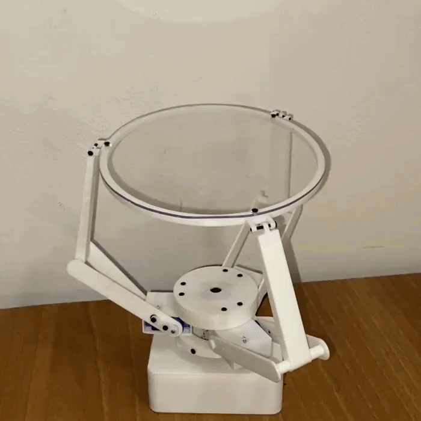
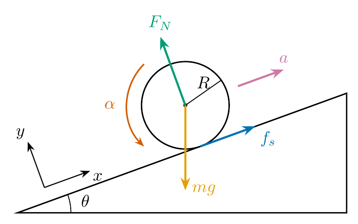

# Ball Balancing Robot

A 3-DOF parallel platform that keeps a ball balanced in the center of a transparent plate. A camera looks at the plate from below and detects the position of the ball, a controller turns the ball position error into a desired plate tilt, and the inverse kinematics turns that tilt into three servo angles.

<p align="center">
  
  
  <br>
  <em>On the left the robot balancing a ball, on the right the robot catching a ball (0.5 speed)</em>
</p>

Different types of controller are tested: a PID controller, an LQR controller and an RL controller.

The code that runs on the robot is in the `scripts` folder, divided into modules: `ball_balancer.py` holds the main loop, `hardware.py` drives the servos and the camera, `vision.py` finds the ball in the frame, `control.py` computes the control action, `kalman.py` estimates the error and its velocity and `kinematics.py` solves the inverse kinematics.

`inverse_kinematics.m` and `linear_quadratic_control.m` are the Matlab references of §1 and §8, and do not run on the robot.

## Running the code

The code runs on the Raspberry Pi of §3, with Raspberry Pi OS. The dependencies are installed with `apt`, and the `pigpio` daemon must be started before the script.

```bash
sudo apt install git python3-picamera2 python3-opencv python3-numpy pigpio python3-pigpio
git clone https://github.com/UmberThor/Ball-Balancing-Robot.git
cd Ball-Balancing-Robot/scripts
sudo pigpiod
python3 ball_balancer.py --pid
```

Exactly one control mode must be selected:

| Flag | Control |
|---|---|
| `--pid` | Proportional Integral Derivative Controller, §7 |
| `--lqr` | Linear Quadratic Regulator Controller, §8 |
| `--rl` | Reinforcement Learning, §9|

The `--gui` flag is optional and opens a window that shows the ball detection of §5, and requires a display. The `--kalman` flag is optional and feeds the controller with the error and the velocity estimated by the Kalman filter of §6 instead of the measured error and its finite difference. The script is stopped with Ctrl+C, or with `q` on the window when `--gui` is set.

---

# 1. Inverse Kinematics

Reference implementation: `inverse_kinematics.m`.

## 1.1 Problem statement

The plate is a rigid disc whose center is constrained to the vertical $z$ axis. It can therefore only *tilt* and *rise*, which is exactly 3 DOF.

**Input**: the pose of the plate:

- $\mathbf{n} = [\alpha,\ \beta,\ \gamma]^T$, the unit normal of the plate,
- $h$, the height of the center of the plate $\mathbf{c} = (0, 0, h)$.

**Output**: the three motor angles $q_1, q_2, q_3$.


## 1.2 Architecture

The actuation mechanism consists of three identical arms, located 120° apart. Each arm $i$ is a two-link RRS chain that connects the base to the plate, so the robot as a whole is a **3-RRS** parallel manipulator: revolute at the shoulder, revolute (pin joint) at the elbow, spherical (ball joint) at the wrist. The shoulder joint is **active**, driven by the motor; the elbow and wrist joints are **passive**.

<p align="center">
  
  <br>
  <em>Architecture of the 3-DOF manipulator for <b>n</b> = [&minus;0.25, 0.33, 1]<sup>T</sup>, plotted by <code>inverse_kinematics.m</code></em>
</p>


| Point / length | Meaning |
|---|---|
| $\mathbf{M}_i$ | coordinates of the $i$-th motor on the base circle of radius $R_b$ |
| $\mathbf{P}_i$ | coordinates of the $i$-th pin joint connecting the two links |
| $\mathbf{B}_i$ | coordinates of the $i$-th ball joint on the plate circle of radius $R_p$ |
| $L_1$ | length of the upper link (link 1) that connects $\mathbf{P}_i$ to $\mathbf{B}_i$ |
| $L_2$ | length of the lower link (link 2) that connects $\mathbf{M}_i$ to $\mathbf{P}_i$ |

The physical constants are:

| Constant | Meaning | Value |
|---|---|---|
| $R_b$ | radius of the base circle | 28.65 mm |
| $R_p$ | radius of the plate circle | 84.00 mm |
| $L_1$ | length of the upper link | 80 mm |
| $L_2$ | length of the lower link | 80 mm |

## 1.3 Planes

Each arm ($\mathbf{M}_i$, $\mathbf{P}_i$ and $\mathbf{B}_i$) is confined to a fixed vertical plane. In coordinates, that plane is simply

$$y = E_i\  x .$$

where $E_i = \frac{M_{iy}}{M_{ix}}$. Under this consideration, the entire 3D problem collapses into three independent 2D problems, one per plane.

<p align="center">
  
  
  
  <br>
  <em>The three arm planes: arm 1 is red, arm 2 is green and arm 3 is blue.<br>Whatever the pose of the plate, each arm and the ball joint it drives stay in their own plane.</em>
</p>

The coordinates of each motor are computed as the points along a circumference of radius $R_b$ spaced by 120°, so the result is:


| Arm | $\mathbf{M}_i$ | $E_i$
|-----|-------|-------|
| 1 | $(-R_b,\ 0,\ 0)$ | $0$
| 2 | $(R_b/2,\ -\tfrac{\sqrt3}{2}R_b,\ 0)$ | $-\sqrt3$ |
| 3 | $(R_b/2,\ +\tfrac{\sqrt3}{2}R_b,\ 0)$ | $+\sqrt3$ |

## 1.4 Step 1 — Ball joint coordinates $\mathbf{B}_i$

$\mathbf{B}_i$ is the intersection of three conditions:

1. it lies on the plate plane: $(\mathbf{B}_i - \mathbf{c}) \cdot \mathbf{n} = 0$
2. it lies in the arm plane
3. it lies on the plate rim

This leads to writing the system:

$$
\begin{cases}
\alpha x + \beta y + \gamma (z - h)= 0 \\
y = E_i x \\
x^2 + y^2 + (z - h)^2 = R_p^2
\end{cases}
$$

Substituting (2) into (1) gives the height along the plane as a function of $x$:

$$z = h - \frac{\alpha + \beta E_i}{\gamma}\ x$$

and substituting both into (3) leaves a pure quadratic in $x$:

$$x^2\left[1 + E_i^2 + \frac{(\alpha + \beta E_i)^2}{\gamma^2}\right] = R_p^2 .$$

Hence the closed form for any arm:

$$
x_i = s_i\ \frac{\gamma R_p}{\sqrt{\gamma^2\left(1 + E_i^2\right) + (\alpha + \beta E_i)^2}},
\qquad y_i = E_i\ x_i,
\qquad z_i = h - \frac{\alpha + \beta E_i}{\gamma}\ x_i$$

where $s_i \in \lbrace -1, +1 \rbrace$ picks the one of the two rim points that is on the motor's side; the other root is the diametrically opposite point of the rim.

Expanding for the three arms gives:

**Arm 1**: $E_1 = 0$, $s_1 = -1$:

$$\mathbf{B}_1 = \left(-\frac{\gamma R_p}{\sqrt{\alpha^2 + \gamma^2}},\quad 0,\quad
h + \frac{\alpha R_p}{\sqrt{\alpha^2 + \gamma^2}}\right)$$

**Arm 2**: $E_2 = -\sqrt3$, $s_2 = +1$:

$$\mathbf{B}_2 = \left(
\frac{\gamma R_p}{\sqrt{4\gamma^2 + \left(\sqrt3\beta - \alpha\right)^2}},\quad
-\frac{\sqrt3\ \gamma R_p}{\sqrt{4\gamma^2 + \left(\sqrt3\beta - \alpha\right)^2}},\quad
h + \frac{R_p\left(\sqrt3\beta - \alpha\right)}{\sqrt{4\gamma^2 + \left(\sqrt3\beta - \alpha\right)^2}}
\right)$$

**Arm 3**: $E_3 = +\sqrt3$, $s_3 = +1$:

$$\mathbf{B}_3 = \left(
\frac{\gamma R_p}{\sqrt{4\gamma^2 + \left(\sqrt3\beta + \alpha\right)^2}},\quad
+\frac{\sqrt3\ \gamma R_p}{\sqrt{4\gamma^2 + \left(\sqrt3\beta + \alpha\right)^2}},\quad
h - \frac{R_p\left(\sqrt3\beta + \alpha\right)}{\sqrt{4\gamma^2 + \left(\sqrt3\beta + \alpha\right)^2}}
\right)$$


Before solving for the elbow, the two-link chain must be able to span the gap between motor and ball joint. The triangle inequality gives, per arm,

$$|L_1 - L_2| < \lVert \mathbf{B}_i - \mathbf{M}_i \rVert < L_1 + L_2$$

If such condition fails, the requested pose $(\mathbf{n}, h)$ is simply not reachable.

## 1.5 Step 2 — Pin joint coordinates $\mathbf{P}_i$

$\mathbf{P}_i$ is again the intersection of three conditions:

1. it is at distance $L_1$ from the ball joint
2. it is at distance $L_2$ from the motor
3. it lies in the arm plane

This leads to writing the system:

$$
\begin{cases}
(x - B_{ix})^2 + (y - B_{iy})^2 + (z - B_{iz})^2 = L_1^2 \\
(x - M_{ix})^2 + (y - M_{iy})^2 + (z - M_{iz})^2 = L_2^2 \\
y = E_i x
\end{cases}
$$

Subtracting sphere (2) from sphere (1) kills every quadratic term and leaves a plane, which solved for $z$ reads

$$z = A_i + B_ix + C_iy$$

with

$$
\begin{gathered}
A_i = \frac{L_1^2 - L_2^2 + \left(M_{ix}^2 - B_{ix}^2\right) + \left(M_{iy}^2 - B_{iy}^2\right) + \left(M_{iz}^2 - B_{iz}^2\right)}{2 (M_{iz} - B_{iz})} \\
B_i = \frac{B_{ix} - M_{ix}}{M_{iz} - B_{iz}} \\
C_i = \frac{B_{iy} - M_{iy}}{M_{iz} - B_{iz}}
\end{gathered}
$$

Geometrically this is the *radical plane* of the two spheres: the plane that contains their intersection circle. Intersecting it with $y = E_i x$ collapses the circle to the two points of a line:

$$y = E_i x, \qquad z = A_i + (B_i + C_i E_i)\ x$$

Putting the line back into condition (1) gives

$$\underbrace{\left[1 + E_i^2 + (B_i + C_iE_i)^2\right]}_{a_i}x^2 +
\underbrace{\left[-2B_{ix} - 2E_iB_{iy} + 2(B_i + C_iE_i)(A_i - B_{iz})\right]}_{b_i}x +
\underbrace{\left[B_{ix}^2 + B_{iy}^2 + (A_i - B_{iz})^2 - L_1^2\right]}_{c_i} = 0$$

$$x_{1,2} = \frac{-b_i \pm \sqrt{b_i^2 - 4a_ic_i}}{2a_i}$$

The two roots are the two physical assemblies of the arm: elbow folded outward and elbow folded inward. The robot is built with the elbow out, so the root to keep is the one that maximizes $|x|$: that is the $+$ root when $s_i = +1$ and the $-$ root when $s_i = -1$.

<p align="center">
  
  
  <br>
  <em>The two roots of the quadratic, for the same pose of the plate: on the left the elbow out configuration, the one the robot is built with, on the right the elbow in one, which is discarded.</em>
</p>

Once $x$ is found, the coordinates of the $i$-th pin joint are:

$$ \mathbf{P}_i = \Big(x,\quad E_i x,\quad A_i + (B_i + C_iE_i)\ x\Big)$$

## 1.6 Step 3 — motor angles $q_i$

The motor angle is the tilt of link 2 ($\mathbf{M}_i \to \mathbf{P}_i$) measured from the vertical.

$$q_i = \arctan\left(\frac{\sqrt{(P_{ix} - M_{ix})^2 + (P_{iy} - M_{iy})^2}}{\lvert P_{iz} - M_{iz}\rvert}\right)$$


## 1.7 Worked example

For $\mathbf{n} = [-0.25, 0.33, 1]$, $h = 100$, with the constants of §1.2:

| | $\mathbf{B}_i$ | $\mathbf{P}_i$ | $q_i$ |
|---|---|---|---|
| 1 | $(-81.49,\ 0,\ 79.63)$ | $(-108.53,\ 0,\ 4.34)$ | $86.89°$ |
| 2 | $(38.85,\ -67.29,\ 131.92)$ | $(44.42,\ -76.94,\ 52.70)$ | $48.80°$ |
| 3 | $(41.47,\ 71.82,\ 86.67)$ | $(53.97,\ 93.47,\ 10.67)$ | $82.33°$ |

## 1.8 Visualization

Running `inverse_kinematics.m` draws the whole assembly: base circle and the three motor points, plate circle with its normal arrow, the three ball joints, the elbows, and both links of every arm, color-coded red / green / blue for arms 1 / 2 / 3.

## 1.9 From Matlab model to physical robot

`inverse_kinematics.m` returns the motor angles of every reachable configuration of the robot, including the ones that need $q > 90°$. The physical robot never uses them: to balance the ball the plate must stay close to horizontal. The nominal pose is therefore $h = 120$ with $\mathbf{n} = [0, 0, 1]$, which gives $q_1 = q_2 = q_3 \approx 59°$. The commands sent to the motors are clipped to $[45°,\ 75°]$, about $\pm 15°$ around the nominal pose: enough travel to correct the position of the ball, and never enough to reach a configuration that the robot cannot assume. The clipped angles are then corrected by the per servo offsets of §4.2.

# 2. Mechanical design

The robot is modeled in Fusion 360.

<p align="center">
  
  <br>
  <em>The assembly moving in Fusion 360</em>
</p>

All the printed parts are in the `3d files` folder:

| File | Part | Qty |
|---|---|---|
| `raspberry_bottom.stl` | lower half of the Raspberry Pi case, the foot of the robot | 1 |
| `raspberry_top.stl` | upper half of the case, modified to carry the motor base | 1 |
| `camera_cover.stl` | cover that holds the camera pointing up at the plate | 1 |
| `motor_base.stl` | frame that holds the three servos 120° apart | 1 |
| `link_lower_half.stl` | half of the lower link, from the motor to the elbow | 6 |
| `link_lower_connector.stl` | connector of the two halves of the lower link | 3 |
| `link_upper.stl` | upper link, from the elbow to the plate | 3 |
| `plate.stl` | ring that holds the transparent plate | 1 |


> **On the ball joints.** They are *modeled* as ball joints but the physical model realizes them as a screw through a clearance hole. That is nominally a pin joint; the extra rotational freedom comes from the clearance, so it is a compliant stand-in for a spherical pair rather than a true ball joint.

<p align="center">
  
  <br>
  <em>The joint connecting the upper link with the plate</em>
</p>

The physical dimensions of the mechanism, $R_b$, $R_p$, $L_1$ and $L_2$, are the ones already reported in §1.2: they are measured on the Fusion 360 model, and they are the values used throughout the project.

In the first version of the robot the links were about half as long as the current ones. The plate was then so close to the camera that the ball covered almost the entire field of view, and its position was detected poorly. The links have therefore been made longer, until the distance between the camera and the plate was enough for a reliable detection, but not so long as to increase excessively the moment arm, and with it the torque the servos need to tilt the plate.

# 3. Electronics

The electronics are kept as simple as possible: a Raspberry Pi 4 Model B, three SG90 servo motors, a CSI camera module and male-female jumper cables.

Each servo has three wires: signal, 5V and ground. The signal wires go to three GPIO pins of the Raspberry Pi:

| Motor | GPIO (BCM) |
|---|---|
| 1 | 13 |
| 2 | 18 |
| 3 | 12 |

The numbers are the BCM numbering used by `pigpio`, not the position of the pin on the header. This is also the order declared in `scripts/hardware.py`, so keeping it makes the code work as it is.

The three grounds go to three distinct GND pins. The 5V pins of the Raspberry Pi are only two, so one servo takes one of them, while the other two share the second one through a jumper cable with one female and two male ends, made by hand.

<p align="center">
  
  <br>
  <em>Wiring of the three servos to the pins of the Raspberry Pi header</em>
</p>

> **On the power supply.** The Raspberry Pi is powered by its own USB-C cable, which outputs 5.1 V at 3 A, and the three servos draw from that same rail. This is not the ideal way to feed three servos: a proper build would power them from a dedicated power supply module, leaving the 5V rail of the Raspberry Pi to the Raspberry Pi alone. Compactness was one of the goals of this project, so the current version accepts the compromise.

The camera is a 5 megapixel CSI module that plugs into the CSI port of the Raspberry Pi.

# 4. 3d print and assembly

## 4.1 3d print

The parts are printed in PLA with the default settings of the slicer. The loads on the structure are low, so orientation and infill are not critical. `motor_base.stl` and `raspberry_top.stl` require supports, `raspberry_bottom.stl` prints better with them but is acceptable without, and the other parts do not need them.


## 4.2 Assembly

Besides the printed parts, the robot needs:

- [Raspberry Pi 4 Model B](https://www.amazon.it/-/en/Raspberry-Pi-W128431608-Model-2GB/dp/B09TTNPB4J)
- [5 megapixel CSI camera module](https://www.amazon.it/dp/B0DKNBP41T?ref=ppx_yo2ov_dt_b_fed_asin_title)
- [30 cm wide flex cable](https://www.amazon.it/dp/B075PBTQPG?ref=ppx_yo2ov_dt_b_fed_asin_title&th=1) for the camera
- 9 male-female jumper cables
- 3 SG90 servo motors, with their horns and the small screw that fixes each horn to its shaft
- 3 M2 screws 15 mm long, for the ball joints between the upper links and the ring
- 9 M2 screws 4 mm long, six to fix the lower links to the servo horns, two per horn, and three to fix the plate to the ring
- 9 M2 screws 10 mm long, six between the camera cover and the motor base and three between the motor base and the top half of the Raspberry Pi case
- a plexiglass disc of 150 mm of diameter for the plate
- a ping pong ball, pink in this build: a ball of a different colour requires the detection of §5 to be adjusted

The horns are mounted with the servos at 90°: each servo is driven to that position before its horn is fixed to the shaft, aligned with the body of the servo. The alignment is necessarily approximate: what is left of it is corrected in software by the constants `OFFSETS` of `scripts/hardware.py`, `[0, -5, -5]` in this build, which are added in degrees to the angles commanded to the three servos.

<p align="center">
  
  <br>
  <em>Position of the horn at 90°</em>
</p>

# 5. Ball detection

The ball is detected by colour in `scripts/vision.py`, on frames of 320 by 240 pixels. The camera runs at 20 Hz, which sets the rate of the loop.

Each frame is converted to HSV and thresholded with hue from 148 to 180, saturation of at least 110 and value of at least 50. A ball of a different colour requires a different range. The mask is cleaned with a morphological opening and closing, and its largest contour is accepted as the ball if its area and the fraction of its minimum enclosing circle it fills are large enough. The centre and the radius of that circle are the output of the detection. The position error, input of the controller, is the vector from the ball to the centre of the frame.

<p align="center">
  
  <br>
  <em>The window of <code>--gui</code>: the frame masked by the detection, with the enclosing circle of the ball and its centre in green, the vector from the centre of the frame to the ball in blue and the control action, scaled, in yellow</em>
</p>

# 6. Kalman filter

The PID of §7 and the LQR of §8 need the velocity of the error, which is not measured, and its finite difference amplifies the noise of the detection. With `--kalman` the error and its velocity are instead estimated by the Kalman filter in `scripts/kalman.py`.

Each axis is treated separately, with the same model: the state is the error $e$ and its velocity $\dot e$, and the input is the slope $u$ of the plate along that axis. A hollow ball rolling on a small slope accelerates along $u$ by $\frac{3}{5} g u$ (§8.1), and the error points from the ball to the centre of the frame, so in pixels, with the scale $s = 2500$ px/m given by the ball radius of 50 px and 0.02 m:

$$\ddot e = c u, \qquad c = -\frac{3}{5} g s = -14715\ \mathrm{px/s^2}$$

With $u$ held constant between two frames, over the measured interval $dt$:

```math
\begin{bmatrix} e \\ \dot e \end{bmatrix}_{k+1} =
\underbrace{\begin{bmatrix} 1 & dt \\ 0 & 1 \end{bmatrix}}_{F}
\begin{bmatrix} e \\ \dot e \end{bmatrix}_k +
\underbrace{\begin{bmatrix} c\ dt^2/2 \\ c\ dt \end{bmatrix}}_{G} u_k +
\mathbf{w}_k
```

where $u_k$ is the slope applied at the previous frame and $\mathbf{w}_k$ is the acceleration the model does not explain, such as friction, servo lag and pushes, taken as random with standard deviation $\sigma_a = 100$ px/s²:

```math
Q = \sigma_a^2 \begin{bmatrix} dt^4/4 & dt^3/2 \\ dt^3/2 & dt^2 \end{bmatrix}
```

Only the error is measured, so $H = [1,\ 0]$, with variance $R = 1$ px². Each frame predicts the state with the model and corrects it with the measured error $z$:

$$
\begin{gathered}
\hat{\mathbf{x}}^- = F \hat{\mathbf{x}} + G u, \qquad P^- = F P F^T + Q \\
y = z - H \hat{\mathbf{x}}^-, \qquad S = H P^- H^T + R, \qquad K = P^- H^T / S \\
\hat{\mathbf{x}} = \hat{\mathbf{x}}^- + K y, \qquad P = (I - K H) P^-
\end{gathered}
$$

where $\hat{\mathbf{x}} = [\hat e,\ \hat{\dot e}]^T$ is the estimate, $P$ its covariance and $K$ the gain. $P$ does not depend on the measurements, so a single one serves both axes.

# 7. PID Control

The PID is in `scripts/control.py` and is selected with `--pid`. Its input is either the error $\mathbf{e}$ measured in §5, whose derivative is then computed as a finite difference, or, with `--kalman`, the error and its derivative estimated in §6.

Each axis is controlled separately, with the same gains:

$$\mathbf{u} = K_p \mathbf{e} + K_i \int \mathbf{e}\ dt + K_d \frac{d \mathbf{e}}{dt}$$

with $K_p = 36 \cdot 10^{-5}$, $K_i = 36 \cdot 10^{-5}$ and $K_d = 20 \cdot 10^{-5}$. The output $\mathbf{u}$ is the dimensionless slope of the plate (§10), so the gains convert pixels into slope. The interval $dt$ is measured on every frame. When the ball is reacquired after being lost, the integral and the previous error are reset.

# 8. LQR Control

The LQR is in `scripts/control.py` and is selected with `--lqr`. As for the PID, its input is either the error $\mathbf{e}$ measured in §5, whose derivative is then computed as a finite difference, or, with `--kalman`, the error and its derivative estimated in §6. Each axis is controlled separately, with the same model. The gain is computed offline in `linear_quadratic_control.m`.

## 8.1 Model

The ball, of mass $m$, radius $R$ and moment of inertia $I$, rolls without slipping on the plate tilted by $\theta$.

<p align="center">
  
  <br>
  <em>Free body diagram of the ball on the plate tilted by &theta;, with the <i>x</i> axis along the slope and &alpha; positive counterclockwise</em>
</p>

Along $x$ and about the centre of the ball, gravity and the static friction $f_s$ give:

$$
\begin{gathered}
f_s - m g \sin\theta = m a \\
I \alpha = R f_s
\end{gathered}
$$

The rolling condition $\alpha = -a / R$ eliminates $f_s$. A ping pong ball is a hollow sphere, $I = \frac{2}{3} m R^2$, so, linearized for small tilts:

$$a = -\frac{g \sin\theta}{1 + \frac{I}{m R^2}} = -\frac{3}{5} g \sin\theta \approx c \theta$$

In pixels, with the scale $s = 2500$ px/m given by the ball radius of 50 px and 0.02 m, $c = -\frac{3}{5} g s = -14715$ px/s² per radian. The state is the position of the ball, its velocity and the integral of the position:

```math
\frac{d}{dt} \begin{bmatrix} x \\ \dot x \\ x_I \end{bmatrix} =
\begin{bmatrix} 0 & 1 & 0 \\ 0 & 0 & 0 \\ 1 & 0 & 0 \end{bmatrix}
\begin{bmatrix} x \\ \dot x \\ x_I \end{bmatrix} +
\begin{bmatrix} 0 \\ c \\ 0 \end{bmatrix} \theta
```

which is controllable for any $c \neq 0$.

## 8.2 Gain

The model is discretized with a zero order hold at $T_s = 1/20$ s, the period of the loop, and $K$ is the gain of the discrete LQR. The weights follow Bryson's rule:

$$Q = \mathrm{diag}\left(\frac{1}{x_{max}^2},\ \frac{1}{\dot x_{max}^2},\ \frac{1}{x_{I,max}^2}\right), \qquad R = \frac{1}{\theta_{max}^2}$$

with $x_{max} = 50$ px, $\dot x_{max} = 100$ px/s, $x_{I,max} = 200$ px·s and $\theta_{max} = 1°$. The resulting gain is

$$K = [-3.756 \cdot 10^{-4},\quad -2.744 \cdot 10^{-4},\quad -7.830 \cdot 10^{-5}]$$

## 8.3 Control law

The LQR gives $\theta = -K [x,\ \dot x,\ x_I]^T$. Since $\theta \approx -u$ (§10) and $e = -x$, the law applied is

$$\mathbf{u} = -K [\mathbf{e},\ \dot{\mathbf{e}},\ \mathbf{e}_I]^T$$

# 9. Reinforcement Learning Control

TODO

# 10. Actuation

The control action $\mathbf{u}$ is a vector of the horizontal plane, and it is imposed on the plate as the direction of steepest descent of its surface: the plate is tilted so that a ball resting on it rolls, and accelerates, along $\mathbf{u}$. A surface of gradient $\nabla z = (a,\ b)$ has upward normal $[-a,\ -b,\ 1]$, so imposing $\mathbf{u} = -\nabla z$ means giving the plate the normal

$$\mathbf{n} = \frac{[u_x,\ u_y,\ 1]}{\lVert [u_x,\ u_y,\ 1] \rVert}$$

which is the pose that §1 turns into the three motor angles, at the fixed height $h = 120$.

The three servos are driven by `pigpio`, which times the pulses with DMA, independently of the Python loop. Each servo receives a pulse every 20 ms, and the width of the pulse sets its angle, from 500 µs at 0° to 2500 µs at 180°. The angles of §1 are clipped to $[45°,\ 75°]$ and shifted by the offsets of §4.2 before being written, and a pose that §1 finds unreachable is skipped, so the servos hold the previous command. At startup the servos are driven to the nominal pose, and at shut down the pulses are stopped, which leaves the servos free.

# 11. Future developments

**Mechanics and electronics**

- A dedicated power supply for the servos, instead of the 5V rail of the Raspberry Pi.
- True spherical joints in place of the screws through clearance holes, whose play is not in the model.
- Metal gear or digital servos in place of the SG90, which have plastic gears, backlash and a coarse resolution.

**Control**

- A model of the lag introduced by the servos and by the processing of the frame, identified from logged data, in the Kalman filter of §6 and in the LQR of §8.
- A calibration of the camera for the scale from pixels to metres, now taken from the radius of the ball.

**New tasks**

- Tracking of a moving target, such as a circle or a figure eight, which requires the more precise actuation above.
- Use of the height $h$, the third degree of freedom of the platform, fixed at 120 in §10: to soften the landing of a ball, as in the catch at the top of this page, or to bounce it.

TODO after RL

# 12. Credits

This project is a reproduction of the ball balancing robot built by [Koshiro Robot Creator](https://www.youtube.com/watch?v=KnYSuQEBGHc). I decided to build my own version mainly to experiment and to learn, but also because I did not have the motors used in the original one: every part has therefore been modeled from scratch, taking inspiration from his design. The only exception is `camera_cover.stl`, which is a modified version of the one published in his [GitHub repository](https://github.com/KoshiroRobot/Ball-Balancing-Robot).

The case that hosts the Raspberry Pi is the [Raspberry Pi 4 case](https://www.printables.com/model/566196-raspberry-pi-4-case) designed by Ryzor_Drone, modified so that it also works as the base of the robot. That model is licensed under [CC BY-NC-SA 4.0](https://creativecommons.org/licenses/by-nc-sa/4.0/), so `raspberry_bottom.stl` and `raspberry_top.stl` are shared under the same license: attribution required, non commercial use only, and any further modification must keep this same license. The other parts, `camera_cover.stl` apart, are modeled from scratch and are not covered by it.
