# Ball Balancing Robot

A 3-DOF parallel platform that keeps a ball balanced in the center of a transparent plate. A camera looks at the plate from below and detects the position of the ball, a controller turns the ball position error into a desired plate tilt, and the inverse kinematics turns that tilt into three servo angles.

<p align="center">
  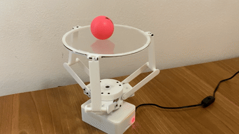
  <br>
  <em>The robot balancing a ball</em>
</p>

Different types of controller are tested: a PID controller, an LQR controller and a Reinforcement Learning controller.

The code that runs on the robot is in the `scripts` folder, divided in modules: `ball_balancer.py` holds the main loop, `hardware.py` drives the servos and the camera, `vision.py` finds the ball in the frame, `control.py` computes the control action and `kinematics.py` solves the inverse kinematics. `inverse_kinematics.m` and `linear_quadratic_control.m` are the Matlab references of §1 and §8, and do not run on the robot.

## Running the code

The code runs on the Raspberry Pi of §3 and needs `picamera2`, OpenCV, NumPy and `pigpio`. The `pigpio` daemon must be started before the script.

```bash
git clone https://github.com/UmberThor/Ball-Balancing-Robot.git
cd Ball-Balancing-Robot/scripts
sudo pigpiod
python3 ball_balancer.py --pid
```

Exactly one control mode must be selected:

| Flag | Control |
|---|---|
| `--pid` | Propotional Integral Derivative Controller, §7 |
| `--lqr` | Linear Quadratic Regulator Controller, §8 |
| `--rl` | Reinforcement Learning, §9|

The `--gui` flag is optional and opens a window that shows the ball detection of §5. The script is stopped with Ctrl+C, or with `q` on the window when `--gui` is set.

---

# 1. Inverse Kinematics

Reference implementation: `inverse_kinematics.m`.

## 1.1 Problem statement

The plate is a rigid disc whose center is constrained to the vertical $z$ axis. It can therefore only *tilt* and *rise*, which is exactly 3 DOF.

**Input**: the pose of the plate:

- $\mathbf{n} = [\alpha,\ \beta,\ \gamma]^T$, the unit normal of the plate,
- $h$, the height of the center of the plate $\mathbf{c} = (0, 0, h)$.

**Output**: the three motor angles $q_1, q_2, q_3$.


## 1.2 Architecture

The actuation mechanism consists of three identical arms, located 120° apart. Each arm $i$ is a two-link RRS chain that connects the base to the plate, so the robot as a whole is a **3-RRS** parallel manipulator: revolute at the shoulder, revolute (pin) at the elbow, spherical at the wrist. The shoulder joint is **active**, driven by the motor; the elbow and wrist joints are **passive**.

<p align="center">
  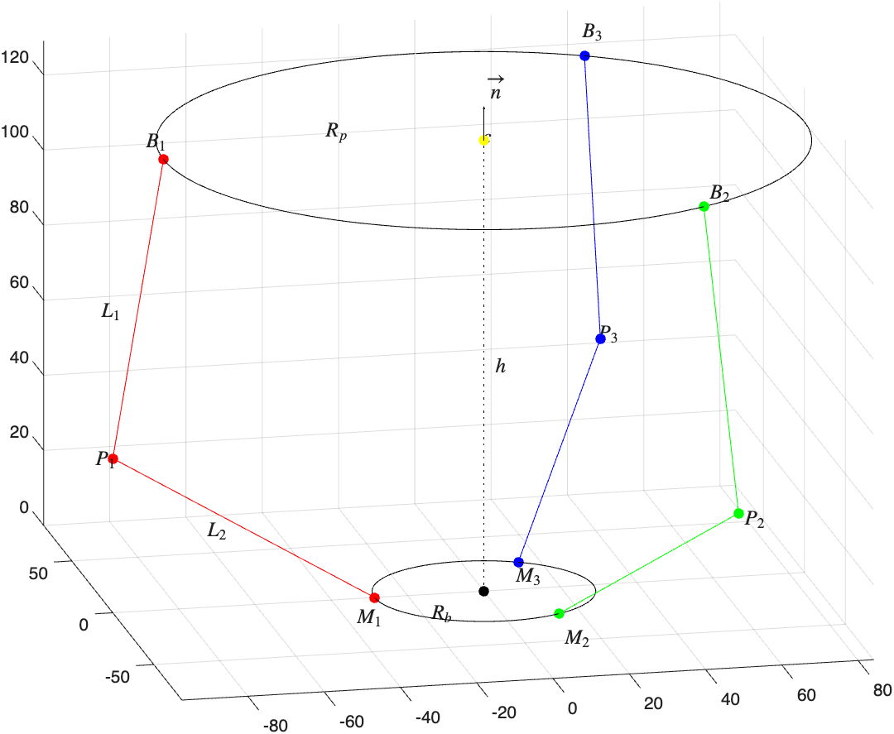
  <br>
  <em>Architecture of the 3-DOF manipulator for <b>n</b> = [&minus;0.25, 0.33, 1]<sup>T</sup>, plotted by <code>inverse_kinematics.m</code></em>
</p>


| Point / length | Meaning |
|---|---|
| $\mathbf{M}_i$ | coordinates of the $i$-th motor, fixed on the base circle of radius $R_b$ |
| $\mathbf{P}_i$ | coordinates of the $i$-th pin joint connecting the two links |
| $\mathbf{B}_i$ | coordinates of the $i$-th ball joint on the plate circle of radius $R_p$ |
| $L_1$ | length of the upper link (link 1) that connects $\mathbf{P}_i$ to $\mathbf{B}_i$ |
| $L_2$ | length of the lower link (link 2) that connects $\mathbf{M}_i$ to $\mathbf{P}_i$ |

The physical constants are:

| Constant | Meaning | Value |
|---|---|---|
| $R_b$ | radius of the base circle | 28.65 mm |
| $R_p$ | radius of the plate circle | 84.00 mm |
| $L_1$ | length of the upper link | 80 mm |
| $L_2$ | length of the lower link | 80 mm |

## 1.3 Planes

Each arm ($\mathbf{M}_i$, $\mathbf{P}_i$ and $\mathbf{B}_i$) is confined to a fixed vertical plane. In coordinates, that plane is simply

$$y = E_i\  x .$$

where $E_i = \frac{M_{iy}}{M_{ix}}$. Under this consideration, the entire 3D problem collapses into three independent 2D problems, one per plane.

<p align="center">
  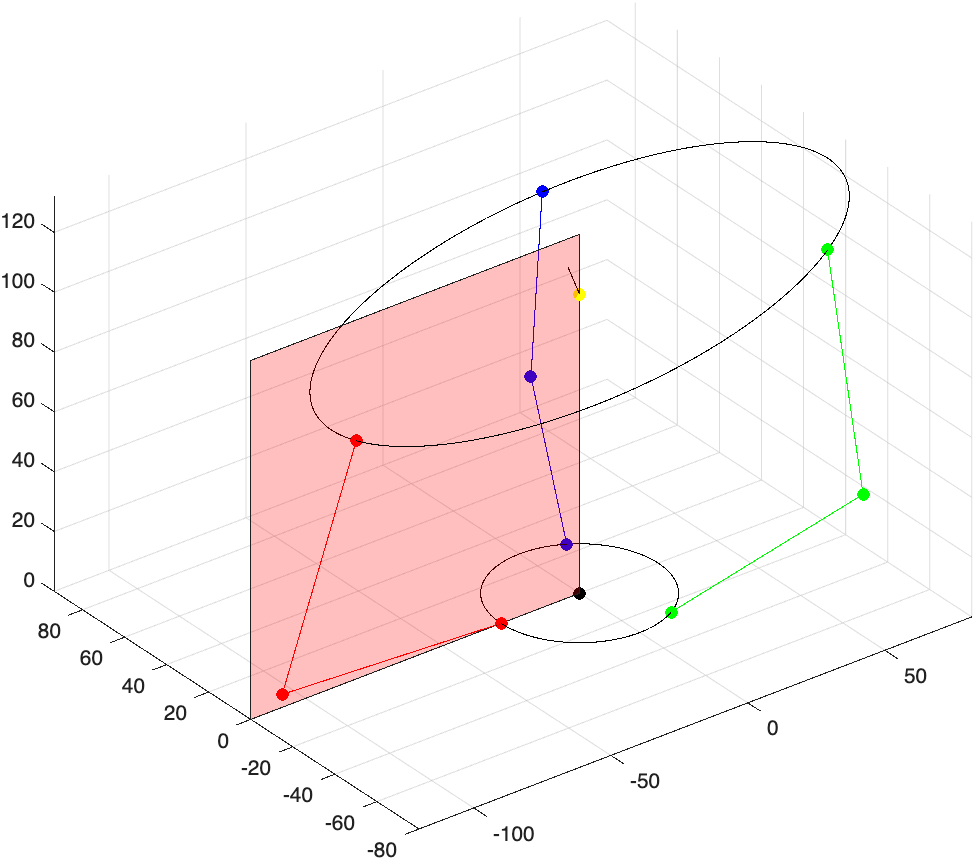
  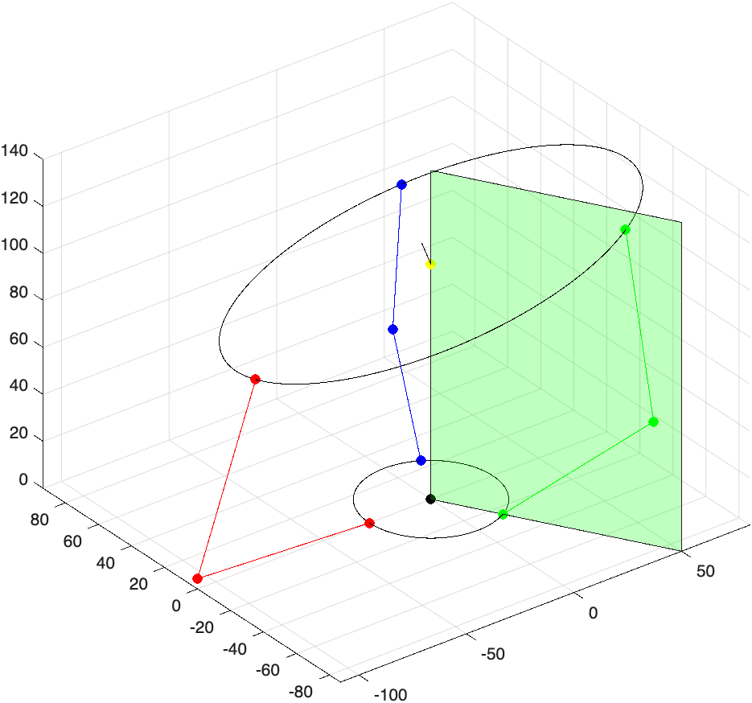
  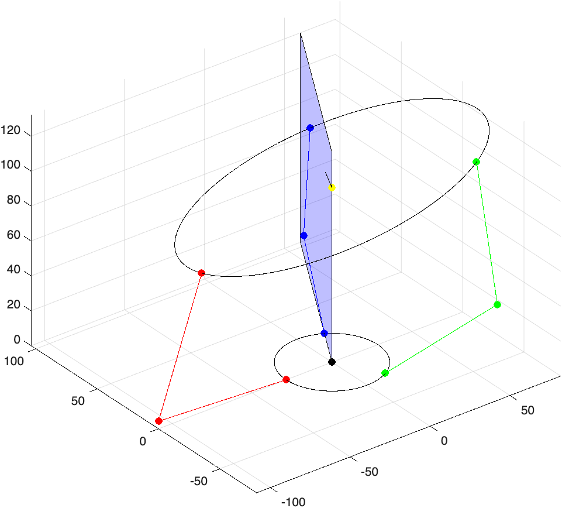
  <br>
  <em>The three arm planes: arm 1 is red, arm 2 is green and arm 3 is blue.<br>Whatever the pose of the plate, each arm and the ball joint it drives stay in their own plane.</em>
</p>

The coordinates of each motor are computed as the points along a circumference of radius $R_b$ spaced by 120°, so the result is:


| Arm | $\mathbf{M}_i$ | $E_i$
|-----|-------|-------|
| 1 | $(-R_b,\ 0,\ 0)$ | $0$
| 2 | $(R_b/2,\ -\tfrac{\sqrt3}{2}R_b,\ 0)$ | $-\sqrt3$ |
| 3 | $(R_b/2,\ +\tfrac{\sqrt3}{2}R_b,\ 0)$ | $+\sqrt3$ |

## 1.4 Step 1 — Ball joint coordinates $\mathbf{B}_i$

$\mathbf{B}_i$ is the intersection of three conditions:

1. it lies on the plate plane: $(\mathbf{B}_i - \mathbf{c}) \cdot \mathbf{n} = 0$
2. it lies in the arm plane
3. it lies on the plate rim

This leads to writing the system:

$$
\begin{cases}
\alpha x + \beta y + \gamma (z - h)= 0 \\
y = E_i x \\
x^2 + y^2 + (z - h)^2 = R_p^2
\end{cases}
$$

Substituting (2) into (1) gives the height along the plane as a function of $x$:

$$z = h - \frac{\alpha + \beta E_i}{\gamma}\ x$$

and substituting both into (3) leaves a pure quadratic in $x$:

$$x^2\left[1 + E_i^2 + \frac{(\alpha + \beta E_i)^2}{\gamma^2}\right] = R_p^2 .$$

Hence the closed form for any arm:

$$
x_i = s_i\ \frac{\gamma R_p}{\sqrt{\gamma^2\left(1 + E_i^2\right) + (\alpha + \beta E_i)^2}},
\qquad y_i = E_i\ x_i,
\qquad z_i = h - \frac{\alpha + \beta E_i}{\gamma}\ x_i$$

where $s_i \in \lbrace -1, +1 \rbrace$ picks the one of the two rim points that is on the motor's side; the other root is the diametrically opposite point of the rim.

Expanding the box for the three arms gives:

**Arm 1**: $E_1 = 0$, $s_1 = -1$:

$$\mathbf{B}_1 = \left(-\frac{\gamma R_p}{\sqrt{\alpha^2 + \gamma^2}},\quad 0,\quad
h + \frac{\alpha R_p}{\sqrt{\alpha^2 + \gamma^2}}\right)$$

**Arm 2**: $E_2 = -\sqrt3$, $s_2 = +1$:

$$\mathbf{B}_2 = \left(
\frac{\gamma R_p}{\sqrt{4\gamma^2 + \left(\sqrt3\beta - \alpha\right)^2}},\quad
-\frac{\sqrt3\ \gamma R_p}{\sqrt{4\gamma^2 + \left(\sqrt3\beta - \alpha\right)^2}},\quad
h + \frac{R_p\left(\sqrt3\beta - \alpha\right)}{\sqrt{4\gamma^2 + \left(\sqrt3\beta - \alpha\right)^2}}
\right)$$

**Arm 3**: $E_3 = +\sqrt3$, $s_3 = +1$:

$$\mathbf{B}_3 = \left(
\frac{\gamma R_p}{\sqrt{4\gamma^2 + \left(\sqrt3\beta + \alpha\right)^2}},\quad
+\frac{\sqrt3\ \gamma R_p}{\sqrt{4\gamma^2 + \left(\sqrt3\beta + \alpha\right)^2}},\quad
h - \frac{R_p\left(\sqrt3\beta + \alpha\right)}{\sqrt{4\gamma^2 + \left(\sqrt3\beta + \alpha\right)^2}}
\right)$$


Before solving for the elbow, the two-link chain must be able to span the gap between motor and ball joint. The triangle inequality gives, per arm,

$$|L_1 - L_2| < \lVert \mathbf{B}_i - \mathbf{M}_i \rVert < L_1 + L_2$$

If such condition fails, the requested pose $(\mathbf{n}, h)$ is simply not reachable.

## 1.5 Step 2 — Pin joint coordinates $\mathbf{P}_i$

$\mathbf{P}_i$ is again the intersection of three conditions:

1. it is at distance $L_1$ from the ball joint
2. it is at distance $L_2$ from the motor
3. it lies in the arm plane

This leads to writing the system:

$$
\begin{cases}
(x - B_{ix})^2 + (y - B_{iy})^2 + (z - B_{iz})^2 = L_1^2 \\
(x - M_{ix})^2 + (y - M_{iy})^2 + (z - M_{iz})^2 = L_2^2 \\
y = E_i x
\end{cases}
$$

Subtracting sphere (2) from sphere (1) kills every quadratic term and leaves a plane, which solved for $z$ reads

$$z = A_i + B_ix + C_iy$$

with

$$
\begin{gathered}
A_i = \frac{L_1^2 - L_2^2 + \left(M_{ix}^2 - B_{ix}^2\right) + \left(M_{iy}^2 - B_{iy}^2\right) + \left(M_{iz}^2 - B_{iz}^2\right)}{2 (M_{iz} - B_{iz})} \\
B_i = \frac{B_{ix} - M_{ix}}{M_{iz} - B_{iz}} \\
C_i = \frac{B_{iy} - M_{iy}}{M_{iz} - B_{iz}}
\end{gathered}
$$

Geometrically this is the *radical plane* of the two spheres: the plane that contains their intersection circle.


Intersecting it with $y = E_i x$ collapses the circle to the two points of a line:

$$y = E_i x, \qquad z = A_i + (B_i + C_i E_i)\ x$$

Putting the line back into condition (1) gives

$$\underbrace{\left[1 + E_i^2 + (B_i + C_iE_i)^2\right]}_{a_i}x^2 +
\underbrace{\left[-2B_{ix} - 2E_iB_{iy} + 2(B_i + C_iE_i)(A_i - B_{iz})\right]}_{b_i}x +
\underbrace{\left[B_{ix}^2 + B_{iy}^2 + (A_i - B_{iz})^2 - L_1^2\right]}_{c_i} = 0$$

$$x_{1,2} = \frac{-b_i \pm \sqrt{b_i^2 - 4a_ic_i}}{2a_i}$$

The two roots are the two physical assemblies of the arm: elbow folded outward and elbow folded inward. The robot is built with the elbow out, so the root to keep is the one that maximizes $|x|$: that is the $+$ root when $s_i = +1$ and the $-$ root when $s_i = -1$.

<p align="center">
  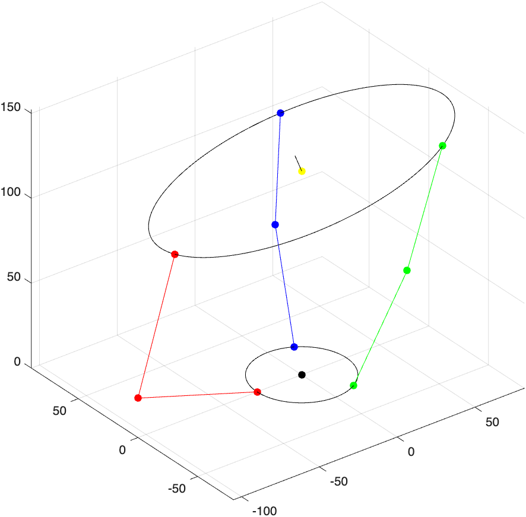
  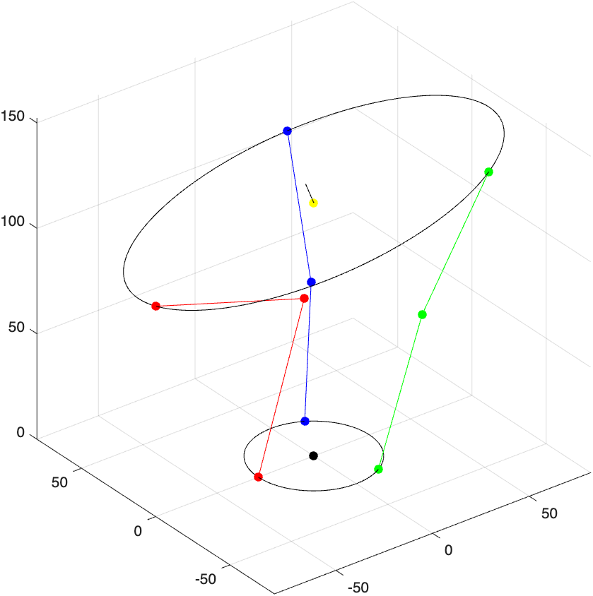
  <br>
  <em>The two roots of the quadratic, for the same pose of the plate: on the left the elbow out configuration, the one the robot is built with, on the right the elbow in one, which is discarded.</em>
</p>

Once $x$ is found, the coordinates of the $i$-th pin joint are:

$$ \mathbf{P}_i = \Big(x,\quad E_i x,\quad A_i + (B_i + C_iE_i)\ x\Big)$$

## 1.6 Step 3 — motor angles $q_i$

The motor angle is the tilt of link 2 ($\mathbf{M}_i \to \mathbf{P}_i$) measured from the vertical.

$$q_i = \arctan\left(\frac{\sqrt{(P_{ix} - M_{ix})^2 + (P_{iy} - M_{iy})^2}}{\lvert P_{iz} - M_{iz}\rvert}\right)$$


## 1.7 Worked example

For $\mathbf{n} = [-0.25, 0.33, 1]$, $h = 100$, with the constants of §1.2:

| | $\mathbf{B}_i$ | $\mathbf{P}_i$ | $q_i$ |
|---|---|---|---|
| 1 | $(-81.49,\ 0,\ 79.63)$ | $(-108.53,\ 0,\ 4.34)$ | $86.89°$ |
| 2 | $(38.85,\ -67.29,\ 131.92)$ | $(44.42,\ -76.94,\ 52.70)$ | $48.80°$ |
| 3 | $(41.47,\ 71.82,\ 86.67)$ | $(53.97,\ 93.47,\ 10.67)$ | $82.33°$ |

## 1.8 Visualization

Running `inverse_kinematics.m` draws the whole assembly: base circle and the three motor points, plate circle with its normal arrow, the three ball joints, the elbows, and both links of every arm, color-coded red / green / blue for arms 1 / 2 / 3.

## 1.9 From Matlab model to physical robot

`inverse_kinematics.m` returns the motor angles of every reachable configuration of the robot, including the ones that need $q > 90°$. The physical robot never uses them: to balance the ball the plate must stay close to horizontal. The nominal pose is therefore $h = 120$ with $\mathbf{n} = [0, 0, 1]$, which gives $q_1 = q_2 = q_3 \approx 59°$. The commands sent to the motors are clipped to $[45°,\ 75°]$, about $\pm 15°$ around the nominal pose: enough travel to correct the position of the ball, and never enough to reach a configuration that the robot cannot assume. The clipped angles are then corrected by the per servo offsets of §4.2.

# 2. Mechanical design

The robot is modeled in Fusion 360.

<p align="center">
  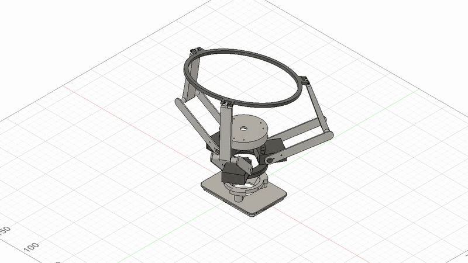
  <br>
  <em>The assembly moving in Fusion 360</em>
</p>

All the printed parts are in the `3d files` folder:

| File | Part | Qty |
|---|---|---|
| `raspberry_bottom.stl` | lower half of the Raspberry Pi case, the foot of the robot | 1 |
| `raspberry_top.stl` | upper half of the case, modified to carry the motor base | 1 |
| `camera_cover.stl` | cover that holds the camera pointing up at the plate | 1 |
| `motor_base.stl` | frame that holds the three servos 120° apart | 1 |
| `link_lower_half.stl` | half of the lower link, from the motor to the elbow | 6 |
| `link_lower_connector.stl` | connector of the two halves of the lower link | 3 |
| `link_upper.stl` | upper link, from the elbow to the plate | 3 |
| `plate.stl` | ring that holds the transparent plate | 1 |

The pins of the joints are not printed: in the real robot they are three screws.


> **On the ball joints.** They are *modeled* as ball joints but the physical model realizes them as a screw through a clearance hole. That is nominally a pin joint; the extra rotational freedom comes from the clearance, so it is a compliant stand-in for a spherical pair rather than a true ball joint.

<p align="center">
  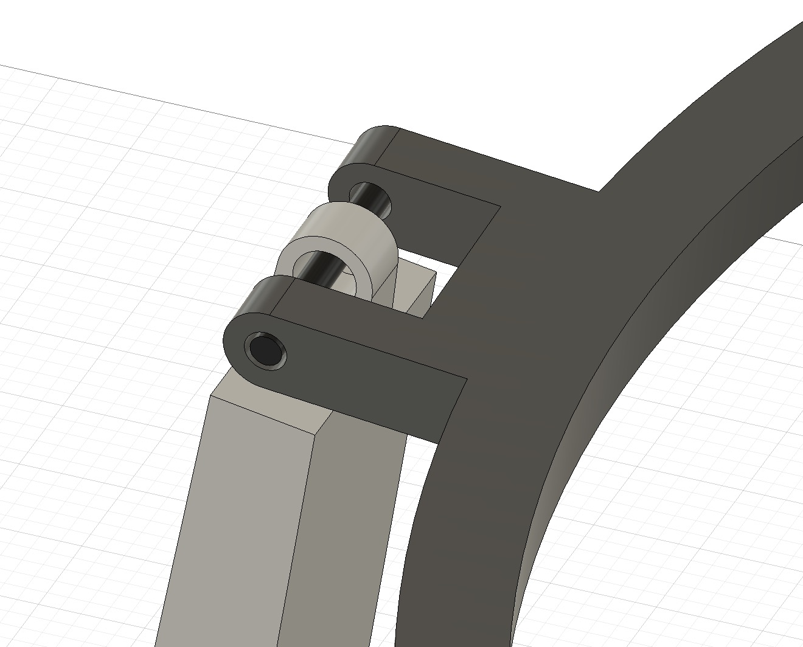
  <br>
  <em>The joint connecting the upper link with the plate</em>
</p>

The physical dimensions of the mechanism, $R_b$, $R_p$, $L_1$ and $L_2$, are the ones already reported in §1.2: they are measured on the Fusion 360 model, and they are the values used throughout the project.

In the first version of the robot the links were about half as long as the current ones. The plate was then so close to the camera that the ball covered almost the entire field of view, and its position was detected poorly. The links have therefore been made longer, until the stand-off between the camera and the plate was enough for a reliable detection, but not so long to increase excessively the moment arm, and with it the torque the servos need to tilt the plate.

# 3. Electronics

The electronics are kept as simple as possible: a Raspberry Pi 4 Model B, three SG90 servo motors, a CSI camera module and male-female jumper cables.

Each servo has three wires: signal, 5V and ground. The signal wires go to three GPIO pins of the Raspberry Pi:

| Motor | GPIO (BCM) | Header pin |
|---|---|---|
| 1 | 13 | 33 |
| 2 | 18 | 12 |
| 3 | 12 | 32 |

The numbers are the BCM numbering used by `pigpio`, not the position of the pin on the header. This is also the order declared in `scripts/hardware.py` (`SERVO_PINS = [13, 18, 12]`), so keeping it makes the code work as it is.

The three grounds go to three distinct GND pins. The 5V pins of the Raspberry Pi are only two, so one servo takes one of them, while the other two share the second one through a jumper cable with one female and two male ends, made by hand.

<p align="center">
  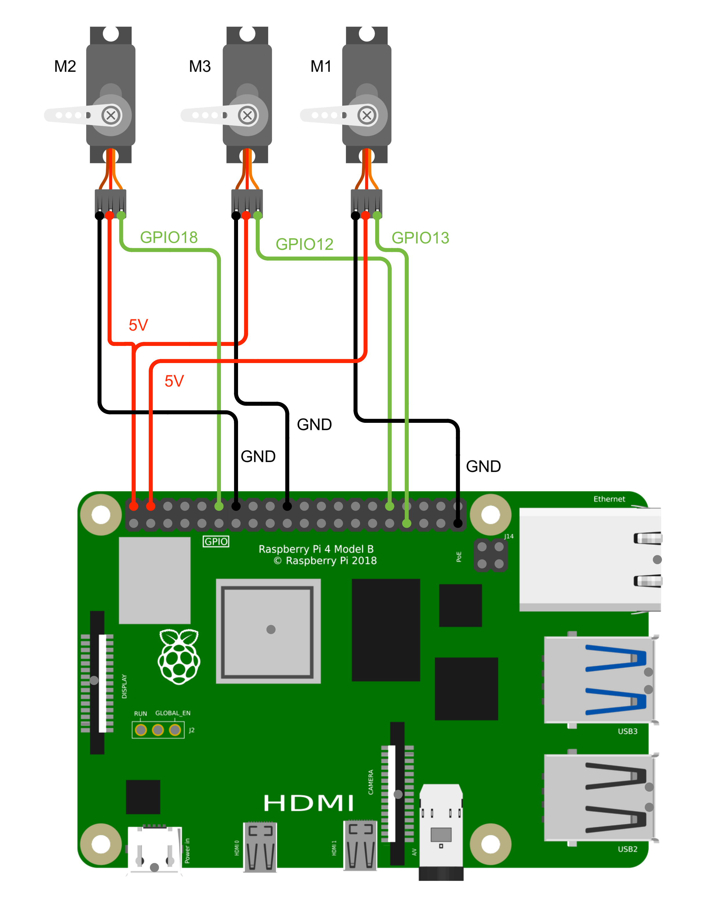
  <br>
  <em>Wiring of the three servos to the pins of the Raspberry Pi header</em>
</p>

> **On the power supply.** The Raspberry Pi is powered by its own USB-C cable, which outputs 5.1 V at 3 A, and the three servos draw from that same rail. This is not the ideal way to feed three servos: a proper build would power them from a dedicated power supply module, leaving the 5V rail of the Raspberry Pi to the Raspberry Pi alone. Compactness was one of the goals of this project, so the current version accepts the compromise.

The camera is a 5 megapixel CSI module with IR filter, and it is the only component that does not use the GPIO header: it plugs into the CSI port of the Raspberry Pi. The ribbon supplied with it is the narrow type, while the CSI connector of the Raspberry Pi 4 takes the wide one, so it is replaced by a 30 cm wide flex cable.

# 4. 3d print and assembly

## 4.1 3d print

The parts are printed in PLA with the default settings of the slicer. The loads on the structure are low, so orientation and infill are not critical. `motor_base.stl` and `raspberry_top.stl` require supports, `raspberry_bottom.stl` prints better with them but is acceptable without, and the other parts do not need them.

The joints are assembled with M2 screws 15 mm long. The hole in the ring is 2 mm and holds the screw, while the hole in the upper link is 3 mm: the radial play that results is what gives the joint the rotational freedom of §2. The axial slide of the link along the screw is limited by the gap between the two walls of the ring.

## 4.2 Assembly

Besides the printed parts, the robot needs:

- [Raspberry Pi 4 Model B]()
- [5 megapixel CSI camera module]()
- [30 cm wide flex cable]() for the camera
- 9 male-female jumper cables
- 3 SG90 servo motors, with their horns and the small screw that fixes each horn to its shaft
- 3 M2 screws 15 mm long, for the ball joints between the upper links and the ring
- 6 M2 screws 4 mm long, two per horn, to fix the lower links to the servo horns
- 9 M2 screws 10 mm long, six between the camera cover and the motor base and three between the motor base and the top half of the Raspberry Pi case
- a transparent acrylic disc of 150 mm of diameter for the plate, at the moment a thin sheet of transparent plastic taped to the ring
- a ping pong ball, pink in this build: a ball of a different colour requires the detection of §5 to be adjusted

The horns are mounted with the servos at 90°: each servo is driven to that position before its horn is fixed to the shaft, aligned with the body of the servo. The spline of the shaft has about twenty teeth, so the horn can only be fitted every 18° and the alignment is necessarily approximate. What is left of it is corrected in software by the constants `OFFSETS` of `scripts/hardware.py`, `[0, -5, -5]` in this build, which are added in degrees to the angles commanded to the three servos.

<p align="center">
  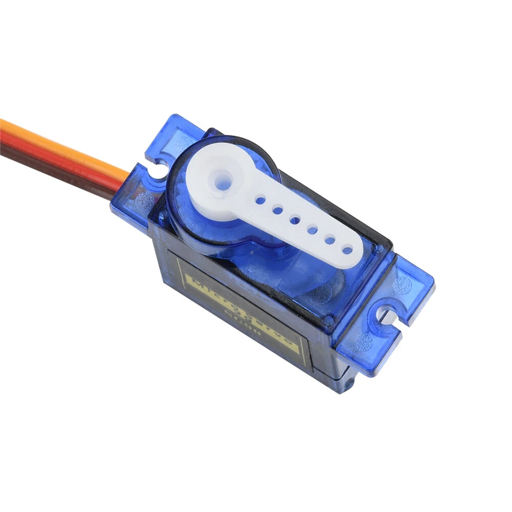
  <br>
  <em>Position of the horn at 90°</em>
</p>

# 5. Ball detection

The ball is found by colour. The detection is in `scripts/vision.py`, works entirely in pixels, and returns the centre and the radius of the ball in the frame, or nothing when the ball is not in view.

The camera delivers frames of 320 by 240 pixels. The duration of the frame is pinned at 25 ms in `scripts/hardware.py`: a frame can never be shorter than the exposure it contains, so fixing its duration also caps the exposure. The automatic exposure is then forced to reach for analogue gain instead of time, which keeps the ball sharp while it moves. The loop itself runs at about 22 Hz, below the 40 Hz of the sensor, limited by the processing of each frame.

Each frame is converted to HSV and thresholded on hue. Pink lies across the origin of the hue circle, so the mask is the union of two ranges, 148 to 180 and 0 to 6, both with saturation and value above 50: a ball of a different colour needs those two ranges changed, and nothing else. The mask is then opened with a 5 by 5 elliptical kernel, which removes the specks of the background, and closed with a 3 by 3 one, which fills the holes inside the ball.

The contours of the mask are extracted and the one of largest area is the candidate. It is accepted as the ball only if it passes two gates: its area must be at least 10% of the area of a circle of radius $R_{ball} = 50$ px, measured on a frame, which discards the blobs too small to be the ball, and it must fill at least 45% of its minimum enclosing circle, which discards the blobs of the right size but of the wrong shape. The centre and the radius of that enclosing circle are the result of the detection.

<p align="center">
  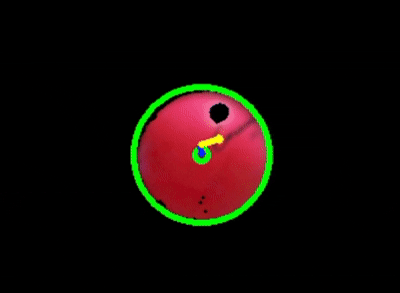
  <br>
  <em>A frame and the mask that the detection extracts from it</em>
</p>

The position error is the vector from the ball to the centre of the frame, and it is the input of the control of §7. Running `ball_balancer.py --gui` draws the ball, the error and the control action on the masked frame, which is the quickest way to check that the thresholds are right.

# 6. Actuation

The control action $\mathbf{u}$ of §7 is a vector of the horizontal plane, and it is imposed on the plate as the direction of steepest descent of its surface: the plate is tilted so that a ball resting on it rolls, and accelerates, along $\mathbf{u}$. A surface of gradient $\nabla z = (a,\ b)$ has upward normal $[-a,\ -b,\ 1]$, so imposing $\mathbf{u} = -\nabla z$ means giving the plate the normal

$$\mathbf{n} = \frac{[u_x,\ u_y,\ 1]}{\lVert [u_x,\ u_y,\ 1] \rVert}$$

which is the pose that §1 turns into the three motor angles, at the fixed height $h = 120$.

The three servos are driven by `pigpio`, which generates the pulses with DMA instead of with the Python interpreter, so their timing does not depend on what the loop is doing. Its daemon must be running, `sudo pigpiod`, otherwise `scripts/hardware.py` stops at startup.

Each servo receives a pulse every 20 ms and its angle is set by the width of that pulse: 500 µs correspond to 0° and 2500 µs to 180°, linear in between. `angle_to_pulse` applies the conversion and `set_angle` writes the three widths on the pins of §3.

The angles come from the inverse kinematics of §1: they are clipped to $[45°,\ 75°]$ and shifted by the offsets of §4.2 before being written. At startup `home()` drives the three servos to the nominal pose, and at shut down the pulses are stopped, which leaves the servos free instead of holding their last position.

# 7. PID Control

The control law is in `scripts/control.py`. Its input is the position error of §5, the vector from the ball to the centre of the frame in pixels, and its output is the tilt of the plate. The two components of the error are treated as two independent axes, with the same gains on both:

$$\mathbf{u} = K_p \mathbf{e} + K_i \int \mathbf{e}\ dt + K_d \frac{d \mathbf{e}}{dt}$$

with $K_p = 36 \cdot 10^{-5}$, $K_i = 36 \cdot 10^{-5}$ and $K_d = 20 \cdot 10^{-5}$. The components of $\mathbf{u}$ have no dimension: they are the slope that §6 imposes on the plate, so the gains convert pixels into slope. The interval $dt$ is measured on every frame, so the loop does not depend on a fixed frame rate.

The integral and the previous error are reset when the ball is reacquired after having been lost: whatever the integral wound up to while the ball was off the plate has nothing to do with the new position. There is no other anti windup, and the derivative is computed on the raw error, without filtering.

# 8. LQR Control

The LQR is in `scripts/control.py` and is selected with `--lqr`. As for the PID, the control problem along $x$ and the one along $y$ are treated as two distinct problems with the same model. The gain is computed offline in `linear_quadratic_control.m`.

## 8.1 Model

The ball rolls without slipping on the plate tilted by $\theta$. Along the normal and along the slope, and for the torques about its centre, where only the static friction $f_s$ acts:

$$
\begin{gathered}
F_N = F_g \cos\theta \\
f_s - F_g \sin\theta = m a \\
I \alpha = R f_s
\end{gathered}
$$

The rolling condition $\alpha = -a / R$ eliminates $f_s$:

$$a = -\frac{g \sin\theta}{1 + \frac{I}{m R^2}}$$

A ping pong ball is a hollow sphere, $I = \frac{2}{3} m R^2$, so that, linearized for small tilts:

$$a = -\frac{3}{5} g \sin\theta \approx c \theta, \qquad c = -\frac{3}{5} g$$

The camera measures the position in pixels, so $c$ is converted with the scale of the image, taken from the ball itself: its radius is 50 px in the frame and 0.02 m in reality, which gives $s = 2500$ px/m and $c = -\frac{3}{5} g s = -14715$ px/s² per radian.

The state is the position of the ball, its velocity and the integral of the position, and the input is the tilt:

$$
\frac{d}{dt} \begin{bmatrix} x \\ \dot x \\ x_I \end{bmatrix} =
\begin{bmatrix} 0 & 1 & 0 \\ 0 & 0 & 0 \\ 1 & 0 & 0 \end{bmatrix}
\begin{bmatrix} x \\ \dot x \\ x_I \end{bmatrix} +
\begin{bmatrix} 0 \\ c \\ 0 \end{bmatrix} \theta
$$

The pair $(A, B)$ is controllable for any $c \neq 0$.

## 8.2 Gain

The model is discretized with a zero order hold at $T_s = 1/20$ s, close to the period of the loop, which runs at about 22 Hz, and $K$ is the gain of the discrete LQR. The weights follow Bryson's rule, which normalizes each state and the input by the largest value acceptable for it:

$$Q = \mathrm{diag}\left(\frac{1}{x_{max}^2},\ \frac{1}{\dot x_{max}^2},\ \frac{1}{x_{I,max}^2}\right), \qquad R = \frac{1}{\theta_{max}^2}$$

with $x_{max} = 50$ px, $\dot x_{max} = 100$ px/s, $x_{I,max} = 200$ px·s and $\theta_{max} = 1°$. The resulting gain is

$$K = [-3.756 \cdot 10^{-4},\quad -2.744 \cdot 10^{-4},\quad -7.830 \cdot 10^{-5}]$$

negative because $c$ is.

## 8.3 Control law

The LQR gives the tilt $\theta = -K [x,\ \dot x,\ x_I]^T$. For small tilts $\theta \approx -u$ (§6), and the code builds the state from the error $e = -x$ of §5, so the two signs cancel and the law applied is

$$\mathbf{u} = -K [\mathbf{e},\ \dot{\mathbf{e}},\ \mathbf{e}_I]^T$$

The velocity is not measured: it is the finite difference of the error, as in the PID. The integral is the sum of the error at the previous step, which is the forward Euler update of $\dot x_I = x$. With this state the LQR law has the same structure as the PID of §7, and the model assigns it $K_p = 37.6 \cdot 10^{-5}$, $K_d = 27.4 \cdot 10^{-5}$ and $K_i = 7.8 \cdot 10^{-5}$.

## 8.4 Kalman filter

# 9. Reinforcement Learning Control

# 10. Future developments

# 11. Credits

This project is a reproduction of the ball balancing robot built by [Koshiro Robot Creator](https://www.youtube.com/watch?v=KnYSuQEBGHc). I decided to build my own version mainly to experiment and to learn, but also because I did not have the motors used in the original one: every part has therefore been modeled from scratch, taking inspiration from his design. The only exception is `camera_cover.stl`, which is a modified version of the one published in his [GitHub repository](https://github.com/KoshiroRobot/Ball-Balancing-Robot).

The case that hosts the Raspberry Pi is the [Raspberry Pi 4 case](https://www.printables.com/model/566196-raspberry-pi-4-case) designed by Ryzor_Drone, modified so that it also works as the base of the robot. That model is licensed under [CC BY-NC-SA 4.0](https://creativecommons.org/licenses/by-nc-sa/4.0/), so `raspberry_bottom.stl` and `raspberry_top.stl` are shared under the same license: attribution required, non commercial use only, and any further modification must keep this same license. The other parts, `camera_cover.stl` apart, are modeled from scratch and are not covered by it.
