# Ball Balancing Robot

A 3-DOF parallel platform that keeps a ball balanced in the center of a transparent plate. A camera looks at the plate from below and detects the position of the ball, a controller turns the ball position error into a desired plate slope, and the inverse kinematics turns that slope into three servo angles.

<p align="center">
  
  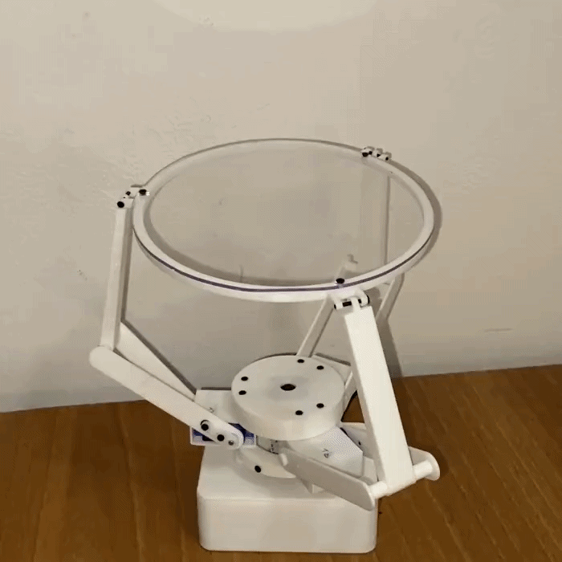
  <br>
  <em>On the left the robot balancing a ball, on the right the robot catching a ball (0.5 speed)</em>
</p>

Three controllers are tested: a PID controller, an LQR controller and an RL controller.

The repository is organized as follows:

```
Ball-Balancing-Robot/
├── scripts/                          code that runs on the robot
│   ├── ball_balancer.py              main loop
│   ├── hardware.py                   servos and camera
│   ├── vision.py                     ball detection
│   ├── kalman.py                     estimate of the error and of its velocity
│   ├── control.py                    PID, LQR and RL controllers
│   ├── kinematics.py                 inverse kinematics
│   └── policy.npz                    weights of the RL policy
├── reinforcement_learning/           simulation and training of the RL controller
│   ├── ball_balancer.xml             MuJoCo model of the plate and the ball
│   ├── ball_balancer_env.py          Gymnasium environment
│   ├── action_limits.ipynb           computation of the action limit
│   ├── reinforcement_learning.ipynb  training of the policy
│   └── environment.yml               conda environment
├── matlab/                           offline references, not run on the robot
│   ├── inverse_kinematics.m          inverse kinematics and plot of the assembly
│   └── linear_quadratic_control.m    computation of the LQR gain
├── metrics/                          evaluation of the controllers
│   ├── metrics.py                    metrics of the logged runs
│   └── log_*.csv                     logged runs
└── 3d files/                         printed parts
```

This README is organized in the following sections:

| § | Section |
|---|---|
| 1 | Running the code |
| 2 | Mechanical design |
| 3 | Electronics |
| 4 | 3D print and assembly |
| 5 | Inverse kinematics |
| 6 | Actuation |
| 7 | Ball detection |
| 8 | Ball model |
| 9 | Kalman filter |
| 10 | PID control |
| 11 | LQR control |
| 12 | Reinforcement learning control |
| 13 | Evaluation metrics |
| 14 | Future developments |
| 15 | Credits |

## 1. Running the code

The code runs on the Raspberry Pi of §3, with Raspberry Pi OS. The dependencies are installed with `apt`, and the `pigpio` daemon must be started before the script.

```bash
sudo apt install git python3-picamera2 python3-opencv python3-numpy pigpio python3-pigpio
git clone https://github.com/UmberThor/Ball-Balancing-Robot.git
cd Ball-Balancing-Robot/scripts
sudo pigpiod
python3 ball_balancer.py --pid
```

Exactly one control mode must be selected:

| Flag | Control |
|---|---|
| `--pid` | Proportional Integral Derivative Controller, §10 |
| `--lqr` | Linear Quadratic Regulator Controller, §11 |
| `--rl` | Reinforcement Learning, §12|

The `--gui` flag is optional and opens a window that shows the ball detection of §7, and requires a display.

The `--kalman` flag is optional and feeds the controller with the error and the velocity estimated by the Kalman filter of §9 instead of the measured error and its finite difference. 

The `--log` flag is optional and, when the script stops, saves to `log_<mode>_<date>_<time>.csv` the time, the measured error and the control action of every frame with the ball. 

The script is stopped with Ctrl+C, or with `q` on the window when `--gui` is set.

---

## 2. Mechanical design

The robot is modeled in Fusion 360.

<p align="center">
  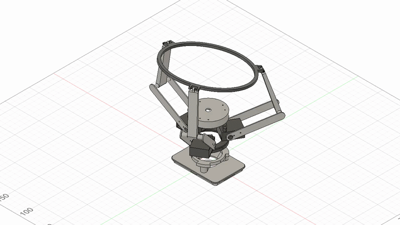
  <br>
  <em>The assembly moving in Fusion 360</em>
</p>

The robot has a fixed base and a moving plate, a printed ring that holds a transparent plexiglass disc. Three identical arms, located 120° apart, connect the base to the plate. Each arm is a two-link RRS chain, so the robot as a whole is a **3-RRS** parallel manipulator: revolute at the shoulder, revolute at the elbow, spherical at the ball joint. The shoulder joint is **active**, driven by a servo; the elbow and the ball joint are **passive**. Each arm is carried by the servo horn alone, so it hangs on one side of the servo.

The robot axes have the origin at the center of the base, at the height of the servo shafts, with $z$ vertical and upward, and $x$ horizontal, from the shoulder of arm 1 through the center of the base. Measured from $x$ towards $y$, arm 1 is at 180°, arm 2 at 300° and arm 3 at 60°.

The dimensions of the mechanism, measured on the Fusion 360 model, are:

| Constant | Meaning | Value |
|---|---|---|
| $R_b$ | radius of the base circle, on which the shoulders lie | 28.65 mm |
| $R_p$ | radius of the plate circle, on which the ball joints lie | 84.00 mm |
| $L_1$ | length of the upper link, from the elbow to the ball joint | 80 mm |
| $L_2$ | length of the lower link, from the shoulder to the elbow | 80 mm |

All the printed parts are in the `3d files` folder:

| File | Part | Qty |
|---|---|---|
| `raspberry_bottom.stl` | lower half of the Raspberry Pi case, the foot of the robot | 1 |
| `raspberry_top.stl` | upper half of the case, modified to carry the servo base | 1 |
| `camera_cover.stl` | cover that holds the camera pointing up at the plate | 1 |
| `motor_base.stl` | base that holds the three servos 120° apart | 1 |
| `link_lower_half.stl` | half of the lower link, from the servo to the elbow | 6 |
| `link_lower_connector.stl` | connector of the two halves of the lower link | 3 |
| `link_upper.stl` | upper link, from the elbow to the plate | 3 |
| `plate.stl` | ring that holds the transparent plate | 1 |


> **On the ball joints.** They are *modeled* as ball joints but the printed robot realizes them as a screw through a clearance hole. That is nominally a pin joint; the extra rotational freedom comes from the clearance, so it is a compliant stand-in for a spherical pair rather than a true ball joint.

<p align="center">
  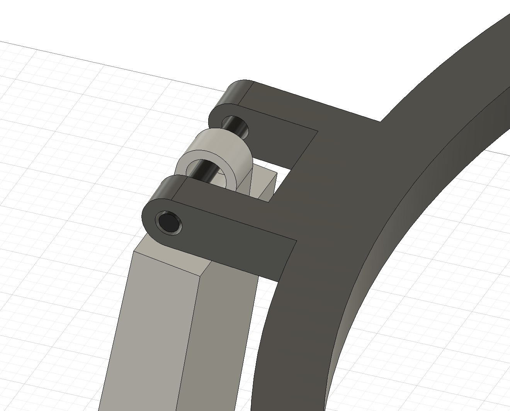
  <br>
  <em>The joint connecting the upper link with the plate</em>
</p>

In the first version of the robot the links were about half as long as the current ones. The plate was then so close to the camera that the ball covered almost the entire field of view, and its position was detected poorly. The links have therefore been made longer, until the distance between the camera and the plate was enough for a reliable detection, but not so long as to increase excessively the moment arm, and with it the torque the servos need to tilt the plate.

## 3. Electronics

The electronics are kept as simple as possible: a Raspberry Pi 4 Model B, three SG90 servos, a 5 megapixel camera module that plugs into the CSI port of the Raspberry Pi, and male-female jumper cables.

Each servo has three wires: signal, 5V and ground. The signal wires go to three GPIO pins of the Raspberry Pi, and servo $i$ drives arm $i$:

| Servo | GPIO (BCM) |
|---|---|
| 1 | 13 |
| 2 | 18 |
| 3 | 12 |

The numbers are the BCM numbering used by `pigpio`, not the position of the pin on the header. This is also the order declared in `scripts/hardware.py`, so keeping it makes the code work as it is.

The three grounds go to three distinct GND pins. The 5V pins of the Raspberry Pi are only two, so one servo takes one of them, while the other two share the second one through a jumper cable with one female and two male ends, made by hand.

<p align="center">
  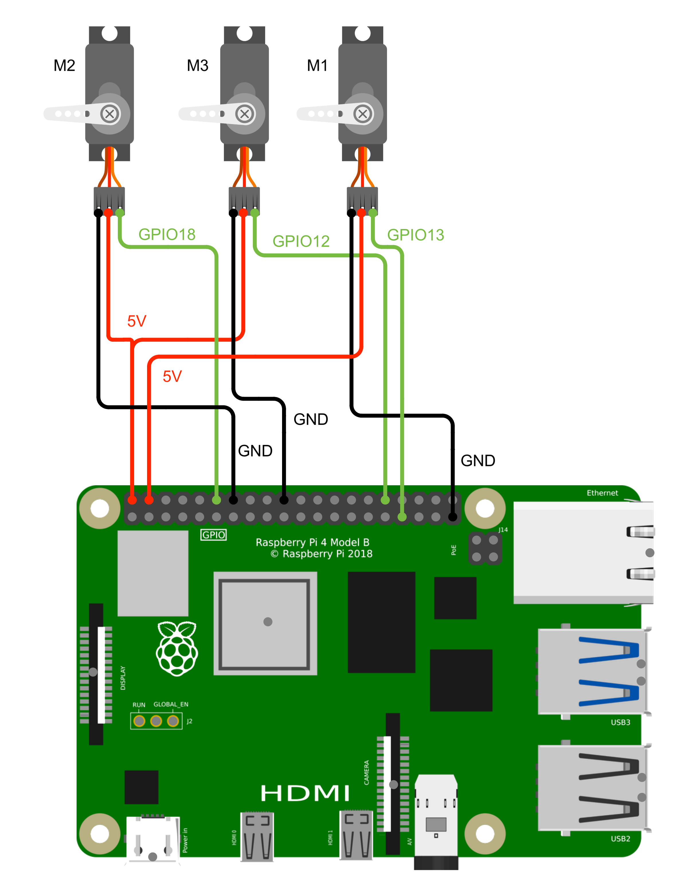
  <br>
  <em>Wiring of the three servos to the pins of the Raspberry Pi header</em>
</p>

> **On the power supply.** The Raspberry Pi is powered by its own USB-C cable, which outputs 5.1 V at 3 A, and the three servos draw from that same rail. This is not the ideal way to feed three servos: a proper build would power them from a dedicated power supply module, leaving the 5V rail of the Raspberry Pi to the Raspberry Pi alone. Compactness was one of the goals of this project, so the current version accepts the compromise.

## 4. 3D print and assembly

### 4.1 3D print

The parts are printed in PLA with the default settings of the slicer. The loads on the structure are low, so orientation and infill are not critical. `motor_base.stl` and `raspberry_top.stl` require supports, `raspberry_bottom.stl` prints better with them but is acceptable without, and the other parts do not need them.


### 4.2 Assembly

Besides the printed parts, the robot needs:

- [Raspberry Pi 4 Model B](https://www.amazon.it/-/en/Raspberry-Pi-W128431608-Model-2GB/dp/B09TTNPB4J)
- [5 megapixel CSI camera module](https://www.amazon.it/dp/B0DKNBP41T?ref=ppx_yo2ov_dt_b_fed_asin_title)
- [30 cm wide flex cable](https://www.amazon.it/dp/B075PBTQPG?ref=ppx_yo2ov_dt_b_fed_asin_title&th=1) for the camera
- 9 male-female jumper cables
- 3 SG90 servos, with their horns and the small screw that fixes each horn to its shaft
- 3 M2 screws 15 mm long, for the ball joints between the upper links and the ring
- 9 M2 screws 4 mm long, six to fix the lower links to the servo horns, two per horn, and three to fix the plate to the ring
- 9 M2 screws 10 mm long, six between the camera cover and the servo base and three between the servo base and the top half of the Raspberry Pi case
- a plexiglass disc of 150 mm of diameter for the plate
- a ping pong ball, pink in this build: a ball of a different color requires the detection of §7 to be adjusted

The horns are mounted with the servos at 90°: each servo is driven to that position before its horn is fixed to the shaft, aligned with the body of the servo. The alignment is necessarily approximate: what is left of it is corrected in software by the constants `OFFSETS` of `scripts/hardware.py`, `[0, -5, -5]` in this build, which are added in degrees to the angles commanded to the three servos.

<p align="center">
  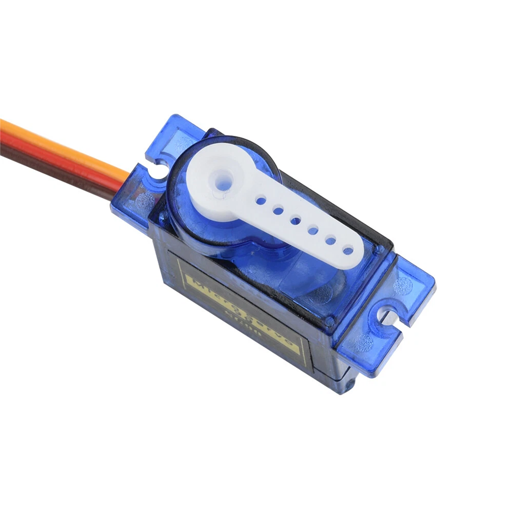
  <br>
  <em>Position of the horn at 90°</em>
</p>

## 5. Inverse kinematics

Reference implementation: `matlab/inverse_kinematics.m`.

### 5.1 Problem statement

In the model, the plate is a rigid disc whose center is constrained to the vertical $z$ axis. It can therefore only *tilt* and *rise*, which is exactly 3 DOF.

The **pose** of the plate is given by:

- $\mathbf{n} = [n_x,\ n_y,\ n_z]^T$, the unit normal of the plate,
- $h$, the height of the center of the plate $(0, 0, h)$, in mm.

The **configuration** of the robot is given by the three servo angles $q_1, q_2, q_3$. The inverse kinematics computes the configuration from the pose.

### 5.2 Geometry

| Point | Meaning |
|---|---|
| $\mathbf{M}_i$ | coordinates of the $i$-th shoulder, on the base circle of radius $R_b$ |
| $\mathbf{P}_i$ | coordinates of the $i$-th elbow, which connects the two links |
| $\mathbf{B}_i$ | coordinates of the $i$-th ball joint, on the plate circle of radius $R_p$ |

The constants $R_b$, $R_p$, $L_1$ and $L_2$ are the ones of §2. Running `inverse_kinematics.m` draws the whole assembly for a given pose:

<p align="center">
  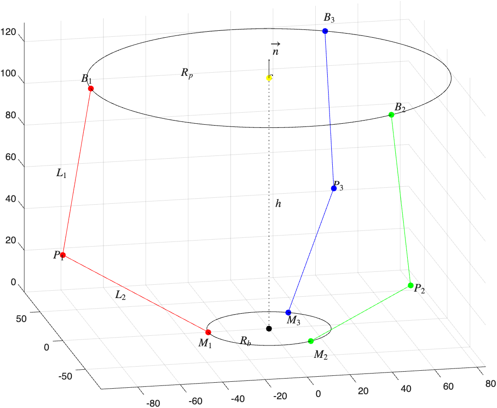
  <br>
  <em>The assembly for <b>n</b> = [&minus;0.25, 0.33, 1]<sup>T</sup>, plotted by <code>inverse_kinematics.m</code>: base circle and the three shoulders, plate circle with its normal arrow, ball joints, elbows and both links of every arm, red / green / blue for arms 1 / 2 / 3</em>
</p>

### 5.3 Planes

Each arm ($\mathbf{M}_i$, $\mathbf{P}_i$ and $\mathbf{B}_i$) is confined to a fixed vertical plane. In coordinates, that plane is simply

$$y = E_i\  x .$$

where $E_i = \frac{M_{iy}}{M_{ix}}$. Under this consideration, the entire 3D problem collapses into three independent 2D problems, one per plane.

<p align="center">
  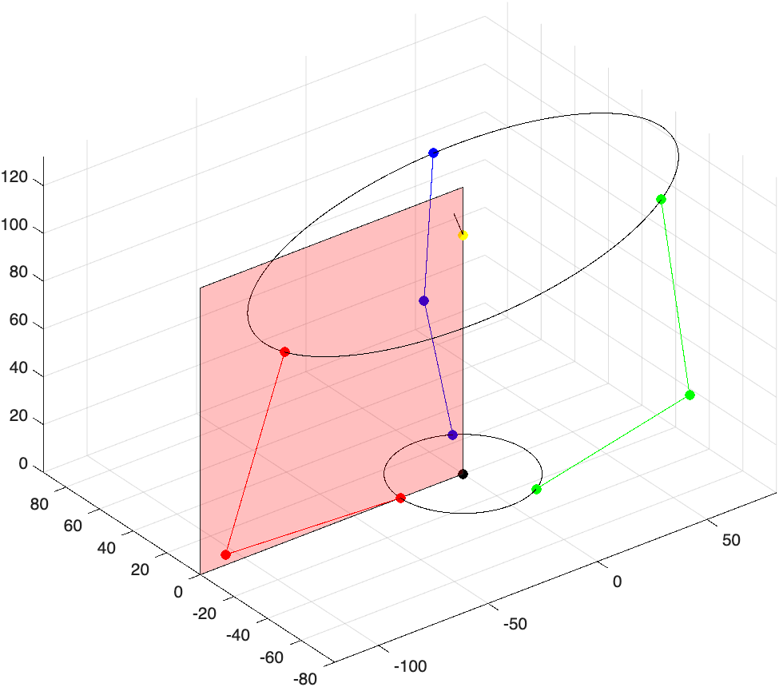
  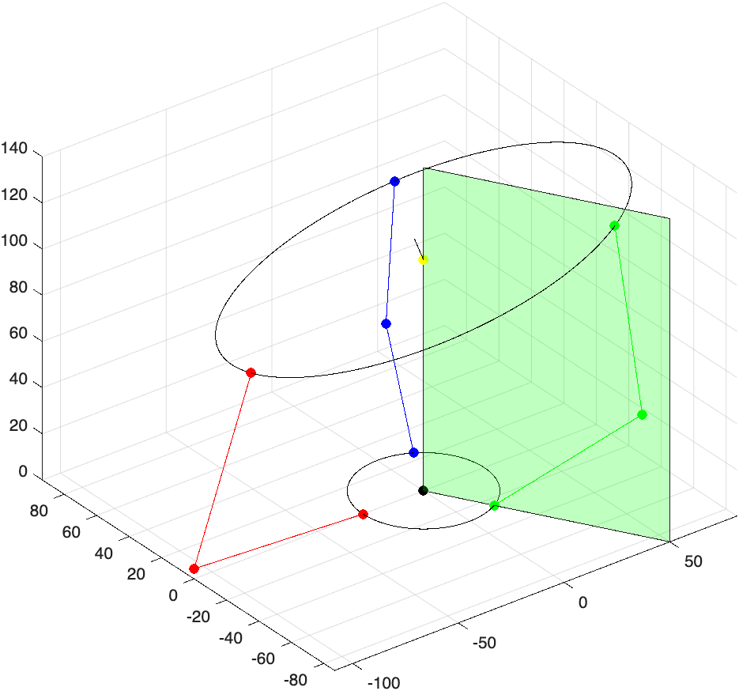
  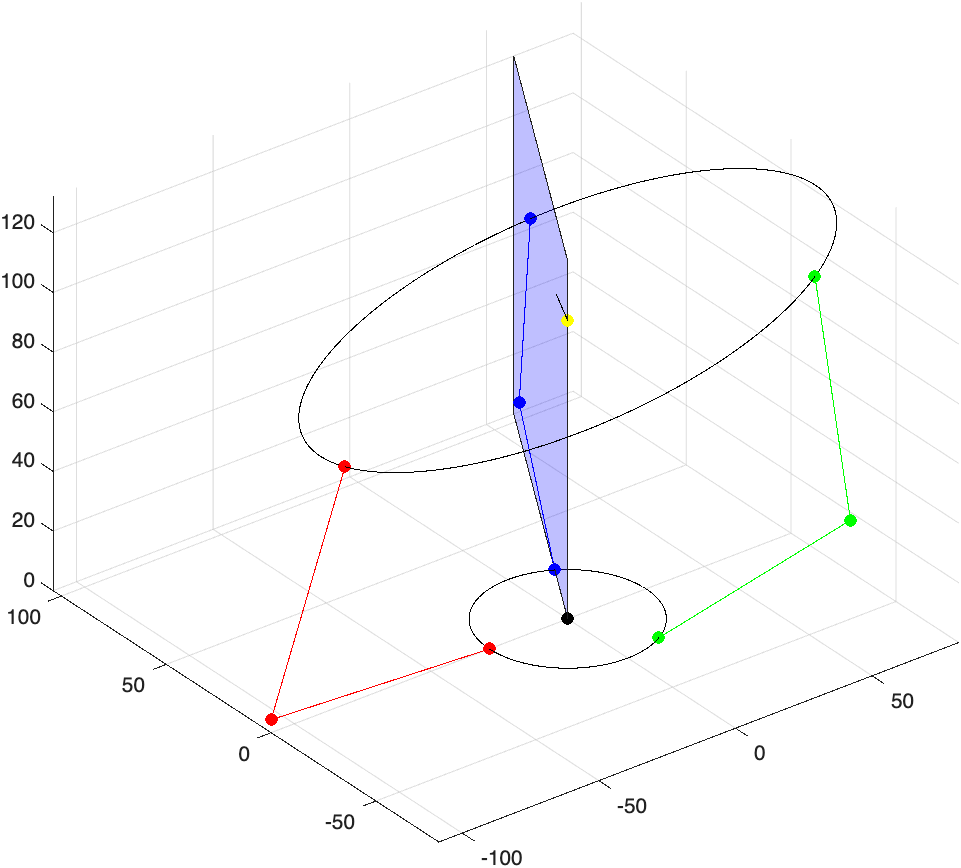
  <br>
  <em>The three arm planes: arm 1 is red, arm 2 is green and arm 3 is blue.<br>Whatever the pose of the plate, each arm and the ball joint it drives stay in their own plane.</em>
</p>

The shoulders lie on the base circle of radius $R_b$, at the angles of §2, so:


| Arm | $\mathbf{M}_i$ | $E_i$
|-----|-------|-------|
| 1 | $(-R_b,\ 0,\ 0)$ | $0$
| 2 | $(R_b/2,\ -\tfrac{\sqrt3}{2}R_b,\ 0)$ | $-\sqrt3$ |
| 3 | $(R_b/2,\ +\tfrac{\sqrt3}{2}R_b,\ 0)$ | $+\sqrt3$ |

### 5.4 Step 1 — Ball joints $\mathbf{B}_i$

$\mathbf{B}_i$ is the intersection of three conditions:

1. it lies in the plane of the plate
2. it lies in the arm plane
3. it lies on the circle of the ball joints

This leads to writing the system:

$$
\begin{cases}
n_x x + n_y y + n_z (z - h)= 0 \\
y = E_i x \\
x^2 + y^2 + (z - h)^2 = R_p^2
\end{cases}
$$

Substituting (2) into (1) gives the height along the plane as a function of $x$:

$$z = h - \frac{n_x + n_y E_i}{n_z}\ x$$

and substituting both into (3) leaves a pure quadratic in $x$:

$$x^2\left[1 + E_i^2 + \frac{(n_x + n_y E_i)^2}{n_z^2}\right] = R_p^2 .$$

Hence the closed form for any arm:

$$
x_i = s_i\ \frac{n_z R_p}{\sqrt{n_z^2\left(1 + E_i^2\right) + (n_x + n_y E_i)^2}},
\qquad y_i = E_i\ x_i,
\qquad z_i = h - \frac{n_x + n_y E_i}{n_z}\ x_i$$

where $s_i \in \lbrace -1, +1 \rbrace$ picks the one of the two points of the plate circle that is on the side of the shoulder; the other root is the diametrically opposite point of the circle.

Expanding for the three arms gives:

**Arm 1**: $E_1 = 0$, $s_1 = -1$:

$$\mathbf{B}_1 = \left(-\frac{n_z R_p}{\sqrt{n_x^2 + n_z^2}},\quad 0,\quad
h + \frac{n_x R_p}{\sqrt{n_x^2 + n_z^2}}\right)$$

**Arm 2**: $E_2 = -\sqrt3$, $s_2 = +1$:

$$\mathbf{B}_2 = \left(
\frac{n_z R_p}{\sqrt{4n_z^2 + \left(\sqrt3n_y - n_x\right)^2}},\quad
-\frac{\sqrt3\ n_z R_p}{\sqrt{4n_z^2 + \left(\sqrt3n_y - n_x\right)^2}},\quad
h + \frac{R_p\left(\sqrt3n_y - n_x\right)}{\sqrt{4n_z^2 + \left(\sqrt3n_y - n_x\right)^2}}
\right)$$

**Arm 3**: $E_3 = +\sqrt3$, $s_3 = +1$:

$$\mathbf{B}_3 = \left(
\frac{n_z R_p}{\sqrt{4n_z^2 + \left(\sqrt3n_y + n_x\right)^2}},\quad
+\frac{\sqrt3\ n_z R_p}{\sqrt{4n_z^2 + \left(\sqrt3n_y + n_x\right)^2}},\quad
h - \frac{R_p\left(\sqrt3n_y + n_x\right)}{\sqrt{4n_z^2 + \left(\sqrt3n_y + n_x\right)^2}}
\right)$$


Before solving for the elbow, the two-link chain must be able to span the gap between shoulder and ball joint. The triangle inequality gives, per arm,

$$|L_1 - L_2| < \lVert \mathbf{B}_i - \mathbf{M}_i \rVert < L_1 + L_2$$

If such condition fails, the requested pose $(\mathbf{n}, h)$ is simply not reachable.

### 5.5 Step 2 — Elbows $\mathbf{P}_i$

$\mathbf{P}_i$ is again the intersection of three conditions:

1. it is at distance $L_1$ from the ball joint
2. it is at distance $L_2$ from the shoulder
3. it lies in the arm plane

This leads to writing the system:

$$
\begin{cases}
(x - B_{ix})^2 + (y - B_{iy})^2 + (z - B_{iz})^2 = L_1^2 \\
(x - M_{ix})^2 + (y - M_{iy})^2 + (z - M_{iz})^2 = L_2^2 \\
y = E_i x
\end{cases}
$$

Subtracting sphere (2) from sphere (1) kills every quadratic term and leaves a plane, which solved for $z$ reads

$$z = \lambda_i + \mu_ix + \nu_iy$$

with

$$
\begin{gathered}
\lambda_i = \frac{L_1^2 - L_2^2 + \left(M_{ix}^2 - B_{ix}^2\right) + \left(M_{iy}^2 - B_{iy}^2\right) + \left(M_{iz}^2 - B_{iz}^2\right)}{2 (M_{iz} - B_{iz})} \\
\mu_i = \frac{B_{ix} - M_{ix}}{M_{iz} - B_{iz}} \\
\nu_i = \frac{B_{iy} - M_{iy}}{M_{iz} - B_{iz}}
\end{gathered}
$$

Geometrically this is the *radical plane* of the two spheres: the plane that contains their intersection circle. Intersecting it with $y = E_i x$ collapses the circle to the two points of a line:

$$y = E_i x, \qquad z = \lambda_i + (\mu_i + \nu_i E_i)\ x$$

Putting the line back into condition (1) gives

$$\underbrace{\left[1 + E_i^2 + (\mu_i + \nu_iE_i)^2\right]}_{a_{2i}}x^2 +
\underbrace{\left[-2B_{ix} - 2E_iB_{iy} + 2(\mu_i + \nu_iE_i)(\lambda_i - B_{iz})\right]}_{a_{1i}}x +
\underbrace{\left[B_{ix}^2 + B_{iy}^2 + (\lambda_i - B_{iz})^2 - L_1^2\right]}_{a_{0i}} = 0$$

$$x = \frac{-a_{1i} \pm \sqrt{a_{1i}^2 - 4a_{2i}a_{0i}}}{2a_{2i}}$$

The two roots are the two physical assemblies of the arm: elbow folded outward and elbow folded inward. The robot is built with the elbow out, so the root to keep is the one that maximizes $|x|$: that is the $+$ root when $s_i = +1$ and the $-$ root when $s_i = -1$.

<p align="center">
  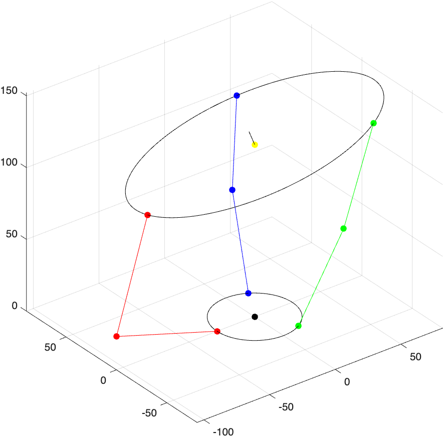
  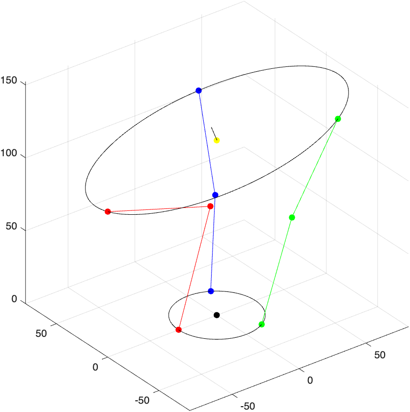
  <br>
  <em>The two roots of the quadratic, for the same pose of the plate: on the left the elbow out configuration, the one the robot is built with, on the right the elbow in one, which is discarded.</em>
</p>

Once $x$ is found, the coordinates of the $i$-th elbow are:

$$ \mathbf{P}_i = \Big(x,\quad E_i x,\quad \lambda_i + (\mu_i + \nu_iE_i)\ x\Big)$$

### 5.6 Step 3 — Servo angles $q_i$

The servo angle is the angle of the lower link ($\mathbf{M}_i \to \mathbf{P}_i$) measured from the vertical.

$$q_i = \arctan\left(\frac{\sqrt{(P_{ix} - M_{ix})^2 + (P_{iy} - M_{iy})^2}}{\lvert P_{iz} - M_{iz}\rvert}\right)$$

The angle commanded to servo $i$ is $q_i$: at $q_i = 90°$ the lower link is horizontal, and the horn is in the position of §4.2.

### 5.7 Worked example

For $\mathbf{n} = [-0.25, 0.33, 1]^T$, $h = 100$ mm, with the constants of §2:

| Arm | $\mathbf{B}_i$ | $\mathbf{P}_i$ | $q_i$ |
|---|---|---|---|
| 1 | $(-81.49,\ 0,\ 79.63)$ | $(-108.53,\ 0,\ 4.34)$ | $86.89°$ |
| 2 | $(38.85,\ -67.29,\ 131.92)$ | $(44.42,\ -76.94,\ 52.70)$ | $48.80°$ |
| 3 | $(41.47,\ 71.82,\ 86.67)$ | $(53.97,\ 93.47,\ 10.67)$ | $82.33°$ |

## 6. Actuation

The control action $\mathbf{u}$ is the **slope** of the plate, a dimensionless vector of the horizontal plane, imposed on the plate as the direction of steepest descent of its surface: the plate is tilted so that a ball resting on it rolls, and accelerates, along $\mathbf{u}$. A surface of gradient $\nabla z = (a,\ b)$ has upward normal $[-a,\ -b,\ 1]$, so imposing $\mathbf{u} = -\nabla z$ means giving the plate the normal

$$\mathbf{n} = \frac{[u_x,\ u_y,\ 1]}{\lVert [u_x,\ u_y,\ 1] \rVert}$$

at the fixed height $h = 120$ mm. The pose is therefore also given by $(u_x,\ u_y,\ h)$, and §5 turns it into the configuration. The nominal pose is $\mathbf{u} = 0$, $h = 120$ mm, which gives $q_1 = q_2 = q_3 \approx 59°$.

§5 returns the configuration of every reachable pose, including the ones that need $q > 90°$. The robot never uses them: to balance the ball the plate must stay close to horizontal. The servo angles are therefore clipped to the travel $[45°,\ 75°]$, about $\pm 15°$ around the nominal pose: enough travel to correct the position of the ball, and never enough to reach a configuration that the robot cannot assume. The clipped angles are then shifted by the offsets of §4.2. A pose that §5 finds unreachable is skipped, so the servos hold the previous command.

The three servos are driven by `pigpio`, which times the pulses with DMA, independently of the Python loop. Each servo receives a pulse every 20 ms, and the width of the pulse sets its angle, from 500 µs at 0° to 2500 µs at 180°. At startup the servos are driven to the nominal pose, and at shut down the pulses are stopped, which leaves the servos free.

## 7. Ball detection

The ball is detected by color in `scripts/vision.py`, on frames of 320 by 240 pixels. The camera runs at 20 Hz, which sets the rate of the loop. The camera is centered under the plate, with the axes of the image parallel to the axes $x$ and $y$ of §2, so the center of the frame is the center of the plate.

Each frame is converted to HSV and thresholded with hue from 148 to 180, saturation of at least 110 and value of at least 50. A ball of a different color requires a different range. The mask is cleaned with a morphological opening and closing, and its largest contour is accepted as the ball if its area is large enough and it fills more than 50% of its minimum enclosing circle. The center and the radius of that circle are the output of the detection. The position error $\mathbf{e}$, input of the controller, is the vector from the ball to the center of the frame, in pixels.

<p align="center">
  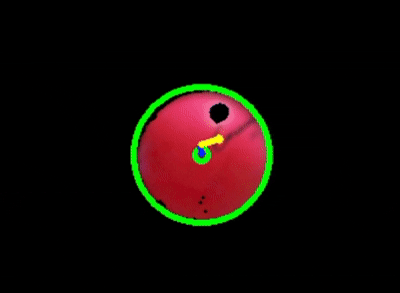
  <br>
  <em>The window of <code>--gui</code>: the frame masked by the detection, with the enclosing circle of the ball and its center in green, the vector from the center of the frame to the ball in blue and the control action, scaled, in yellow</em>
</p>

## 8. Ball model

The Kalman filter of §9, the LQR of §11 and the simulation of §12 use the same model of the ball. The ball, of mass $m$, radius $r$ and moment of inertia $I$, rolls without slipping on the plate tilted by $\theta$.

<p align="center">
  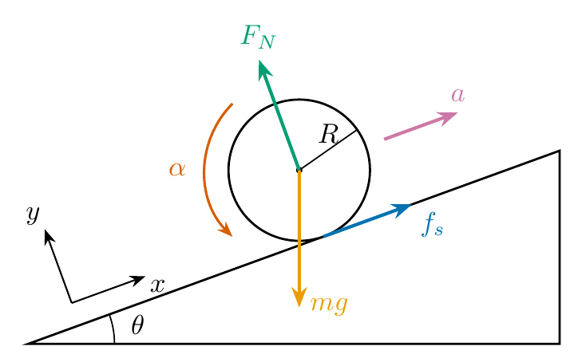
  <br>
  <em>Free body diagram of the ball on the plate tilted by &theta;, with the <i>x</i> axis along the slope and &alpha; positive counterclockwise</em>
</p>

Along $x$ and about the center of the ball, gravity and the static friction $f_s$ give:

$$
\begin{gathered}
f_s - m g \sin\theta = m \ddot x \\
I \alpha = r f_s
\end{gathered}
$$

The rolling condition $\alpha = -\ddot x / r$ eliminates $f_s$. A ping pong ball is a hollow sphere, $I = \frac{2}{3} m r^2$, so:

$$\ddot x = -\frac{g \sin\theta}{1 + \frac{I}{m r^2}} = -\frac{3}{5} g \sin\theta$$

For small tilts $\sin\theta \approx \tan\theta = \lVert \mathbf{u} \rVert$, so the ball accelerates along $\mathbf{u}$ by $\frac{3}{5} g \lVert \mathbf{u} \rVert$. The error points from the ball to the center of the frame, so, in pixels, with the scale $\rho = 2500$ px/m given by the ball radius of 50 px and 0.02 m, each axis follows

$$\ddot e = c u, \qquad c = -\frac{3}{5} g \rho = -14715\ \mathrm{px/s^2}$$

## 9. Kalman filter

The PID of §10 and the LQR of §11 need the error and its velocity. Without `--kalman`, they use the error $\mathbf{e}$ measured in §7 and its finite difference, which amplifies the noise of the detection. With `--kalman`, they use the error and the velocity estimated by the Kalman filter in `scripts/kalman.py`.

Each axis is treated separately, with the model of §8: the state is the error $e$ and its velocity $\dot e$, and the input is the slope $u$ of the plate along that axis. The state $\boldsymbol{\xi}_k = [e,\ \dot e]^T$ is the state at frame $k$. The slope $u_k$ is commanded at frame $k$ and does not change until frame $k+1$. $dt$ is the measured time from frame $k$ to frame $k+1$:

```math
\boldsymbol{\xi}_{k+1} =
\underbrace{\begin{bmatrix} 1 & dt \\ 0 & 1 \end{bmatrix}}_{F}
\boldsymbol{\xi}_k +
\underbrace{\begin{bmatrix} c\ dt^2/2 \\ c\ dt \end{bmatrix}}_{G} u_k +
\mathbf{w}_k
```

where $\mathbf{w}_k$ is the acceleration the model does not explain, such as friction, servo lag and pushes, taken as random with standard deviation $\sigma_a = 100$ px/s²:

```math
Q_w = \sigma_a^2 \begin{bmatrix} dt^4/4 & dt^3/2 \\ dt^3/2 & dt^2 \end{bmatrix}
```

Only the error is measured: the measurement is $e_m = \mathbf{m}\boldsymbol{\xi}$, with $\mathbf{m} = [1,\ 0]$ and variance $\sigma_m^2 = 1$ px². Each frame predicts the state with the model and corrects it with the measured error $e_m$:

$$
\begin{gathered}
\hat{\boldsymbol{\xi}}^- = F \hat{\boldsymbol{\xi}} + G u, \qquad \Sigma^- = F \Sigma F^T + Q_w \\
S = \mathbf{m} \Sigma^- \mathbf{m}^T + \sigma_m^2, \qquad \mathbf{k}_f = \Sigma^- \mathbf{m}^T / S \\
\hat{\boldsymbol{\xi}} = \hat{\boldsymbol{\xi}}^- + \mathbf{k}_f \left(e_m - \mathbf{m}\hat{\boldsymbol{\xi}}^-\right), \qquad \Sigma = (I - \mathbf{k}_f \mathbf{m}) \Sigma^-
\end{gathered}
$$

where $\hat{\boldsymbol{\xi}} = [\hat e,\ \hat{\dot e}]^T$ is the estimate, $\Sigma$ its covariance and $\mathbf{k}_f$ the gain of the filter. $\Sigma$ does not depend on the measurements, so a single one serves both axes.

## 10. PID control

The PID is in `scripts/control.py` and is selected with `--pid`. Each axis is controlled separately, with the same gains:

$$\mathbf{u} = K_p \mathbf{e} + K_i \int \mathbf{e}\ dt + K_d \frac{d \mathbf{e}}{dt}$$

with $K_p = 36 \cdot 10^{-5}$, $K_i = 36 \cdot 10^{-5}$ and $K_d = 20 \cdot 10^{-5}$. The gains convert pixels into slope. The interval $dt$ is measured on every frame. When the ball is reacquired after being lost, the integral and the previous error are reset.

## 11. LQR control

The LQR is in `scripts/control.py` and is selected with `--lqr`. Each axis is controlled separately, with the same gain, computed offline in `matlab/linear_quadratic_control.m`.

### 11.1 Model

The state is the error, its velocity and its integral $e_I = \int e\ dt$, and with the model of §8:

```math
\frac{d}{dt} \begin{bmatrix} e \\ \dot e \\ e_I \end{bmatrix} =
\begin{bmatrix} 0 & 1 & 0 \\ 0 & 0 & 0 \\ 1 & 0 & 0 \end{bmatrix}
\begin{bmatrix} e \\ \dot e \\ e_I \end{bmatrix} +
\begin{bmatrix} 0 \\ c \\ 0 \end{bmatrix} u
```

which is controllable for any $c \neq 0$.

### 11.2 Gain and control law

The model is discretized with a zero order hold at $T_s = 1/20$ s, the period of the loop, and $K$ is the gain of the discrete LQR. The weights follow Bryson's rule:

$$Q = \mathrm{diag}\left(\frac{1}{\bar e^2},\ \frac{1}{\bar{\dot e}^2},\ \frac{1}{\bar e_I^2}\right), \qquad R = \frac{1}{\bar u^2}$$

with the largest acceptable values $\bar e = 50$ px, $\bar{\dot e} = 100$ px/s, $\bar e_I = 200$ px·s and $\bar u = 0.0175$, a slope of 1°. The resulting gain is

$$K = [-3.756 \cdot 10^{-4},\quad -2.744 \cdot 10^{-4},\quad -7.830 \cdot 10^{-5}]$$

and the control law is

$$\mathbf{u} = -K [\mathbf{e},\ \dot{\mathbf{e}},\ \mathbf{e}_I]^T$$

## 12. Reinforcement learning control

The neural network trained with RL, the policy, is in `scripts/control.py` and is selected with `--rl`. It is trained in a simulation of the robot, and only the trained network runs on the Raspberry Pi. Everything about the training is in the `reinforcement_learning` folder.

### 12.1 Simulation

The robot is simulated in MuJoCo, in `ball_balancer.xml`, and wrapped in a Gymnasium environment, `ball_balancer_env.py`. Only the plate and the ball are simulated. The physics advances by 25 steps of 2 ms for each control step, which gives the 20 Hz of the loop of §7.

What the policy commands is the quantity of the robot. The action is the slope of the plate, $\mathbf{u} = U_{max} \mathbf{a}$ with $\mathbf{a} \in [-1, 1]^2$ and $U_{max} = 0.14$, the largest value for which no action of the square leaves the travel $[45°,\ 75°]$ of §6, computed in `action_limits.ipynb`.

<p align="center">
  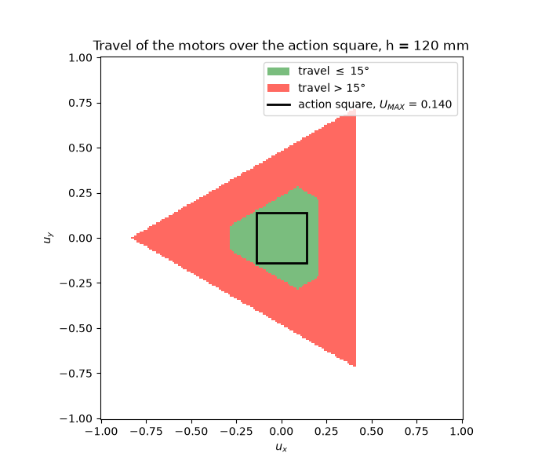
  <br>
  <em>Travel of the servos over the plane of the slopes: green where no servo leaves its travel, red beyond it, white where the pose is unreachable. The square is the one of the actions</em>
</p>

The action then goes through the same chain as the output of the PID: §6 turns it into a pose and §5, with the same `kinematics.py` that runs on the robot, into a configuration, which is clipped to the travel. Between the command and the plate the simulation reproduces what the servos add: a first order lag with a rate limit, and a dead band, below which the servo ignores a command, that also stands for the backlash of its gears. The dead band is what makes the ball oscillate around the center instead of settling on it.

The configuration reached by the servos is then turned back into the pose of the plate, at which the plate is driven through its three joints. This forward kinematics is solved with a quasi-Newton method. The Jacobian $J$ of the inverse kinematics, from the pose $(u_x,\ u_y,\ h)$ to the configuration $(q_1,\ q_2,\ q_3)$, is precomputed around the nominal pose: it tells how much the configuration changes in response to a small change of the pose. Its inverse $J^{-1}$ tells how much the pose changes in response to a small change of the configuration, and corrects the pose at each iteration by $J^{-1}$ times the difference between the configuration of the servos and the one §5 gives for the current pose. It is Newton's method applied to the forward kinematics, with the Jacobian fixed at the nominal pose.

The latency of the loop, the time constant of the servos, the noise of the detection and the scale of the camera are drawn at every reset, so that the policy is trained on a family of robots rather than on one:

| Parameter | Nominal | Range |
|---|---|---|
| dead band of the servos | 2.0° | 1.5° to 2.5° |
| latency of the loop | 0.06 s | 0.04 s to 0.10 s |
| time constant of the servos | 0.025 s | 0.015 s to 0.05 s |
| noise of the detection | 2 px | 0.5 px to 2 px |
| scale of the camera | 2500 px/m | ±10% |

<p align="center">
  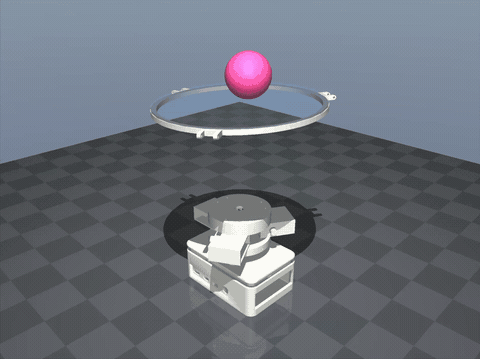
  <br>
  <em>The trained policy balancing the ball in the simulation: the arms are not simulated, so the plate floats above the base</em>
</p>


### 12.2 Policy

The velocity of the ball is not measured, so the observation carries a history: the last 6 errors, divided by half the width of the frame, and the last 3 actions, 18 numbers in all. The actions are part of the observation because the delay hides their effect: the frame the policy sees is older than the slope the plate already has.

The reward keeps the ball at the center without asking the servos for more than they can do:

$$r = 1 - \frac{\lVert \mathbf{e} \rVert}{120\ \mathrm{px}} - 0.1 \lVert \mathbf{a} \rVert^2 - 5 \lVert \mathbf{a} - \mathbf{a}_{prev} \rVert^2$$

where $\mathbf{e}$ is the error of §7. The last term penalizes the change of the action, because a chattering command wears the servos without moving the ball. An episode ends when the ball leaves the frame, or after 400 steps, 20 s.

<p align="center">
  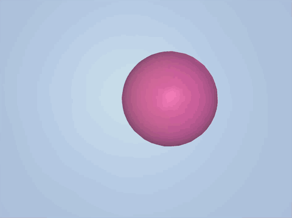
  <br>
  <em>The simulated camera looking up at the plate, the frame on which the error <b>e</b> is measured</em>
</p>

The policy is trained for 100 000 steps with SAC, from `stable-baselines3`, in `reinforcement_learning.ipynb`, where the PID and the LQR of `scripts/control.py` are also run in the simulation as a reference. The network is the default of the library: two hidden layers of 256 units with ReLU, and a tanh on the output.


### 12.3 On the robot

Only the actor is deployed. Its weights are exported to `scripts/policy.npz`, and `control.rl` evaluates the network, 18 → 256 → 256 → 2, in NumPy, so the Raspberry Pi does not need PyTorch. The function keeps the history of errors and actions that the observation needs, and it is reset with the rest of the control when the ball is reacquired.

## 13. Evaluation metrics

The three controllers are compared on the robot, on a run of 60 s each. Running `ball_balancer.py` with `--log` writes a csv with the time, the error and the control action of every frame in which the ball is seen, and `metrics/metrics.py` reduces one or more of those files to four numbers.

The first 5 s of each run are discarded, since they are the transient of the acquisition. 

| Metric | Meaning |
|---|---|
| err mean | Distance of the average position of the ball from the center of the plate |
| err std | Spread of the ball around its average position |
| u mean | Average slope given to the plate |
| du mean | Average change of the slope between two consecutive frames |

| Run | err mean [mm] | err std [mm] | u mean [°] | du mean [°] |
|---|---|---|---|---|
| PID, §10 | 1.4 | 19.4 | 2.32 | 0.31 |
| LQR, §11 | 4.6 | 16.9 | 2.91 | 0.46 |
| RL, §12 | 29.3 | 19.0 | 4.52 | 1.73 |

The PID and the LQR keep the ball on the plate for the whole run, while the RL policy drops it twice and needs it to be put back. The PID centers the ball with the smallest and quietest command. The LQR holds it slightly off center and is a little more active, but its spread is the smallest of the three. The RL policy settles about 3 cm from the center, with a slope twice as large and a change of slope between frames more than five times as large.

In simulation the same RL policy never loses the ball and holds it at the center, so the gap is in the simulation itself: it remains too ideal and does not capture the whole dynamics of the robot, above all the play of the ball joints and the arms carried on one side of the servos (§2). The policy exploits a plate that answers better than the real one, and on the robot that margin is not there.

## 14. Future developments

**Mechanics and electronics**

- A dedicated power supply for the servos, instead of the 5V rail of the Raspberry Pi.
- True spherical joints in place of the screws through clearance holes, whose play is not in the model.
- Metal gear or digital servos in place of the SG90, which have plastic gears, backlash and a coarse resolution.
- Servos with a double shaft, which hold each arm on both sides.

**Control**

- A model of the lag introduced by the servos and by the processing of the frame, identified from logged data, in the Kalman filter of §9 and in the LQR of §11.
- A calibration of the camera for the scale from pixels to meters, now taken from the radius of the ball.
- A more realistic simulation, which would improve the performance of the RL policy on the robot, followed by a phase of fine tuning on the robot itself.

**New tasks**

- Tracking of a moving target, such as a circle or a figure eight, which requires the more precise actuation above.
- Use of the height $h$, the third degree of freedom of the platform, fixed at 120 mm in §6: to soften the landing of a ball, as in the catch at the top of this page, or to bounce it.

## 15. Credits

This project is a reproduction of the ball balancing robot built by [Koshiro Robot Creator](https://www.youtube.com/watch?v=KnYSuQEBGHc). I decided to build my own version mainly to experiment and to learn, but also because I did not have the motors used in the original one: every part has therefore been modeled from scratch, taking inspiration from his design. The only exception is `camera_cover.stl`, which is a modified version of the one published in his [GitHub repository](https://github.com/KoshiroRobot/Ball-Balancing-Robot).

The case that hosts the Raspberry Pi is the [Raspberry Pi 4 case](https://www.printables.com/model/566196-raspberry-pi-4-case) designed by Ryzor_Drone, modified so that it also works as the foot of the robot. That model is licensed under [CC BY-NC-SA 4.0](https://creativecommons.org/licenses/by-nc-sa/4.0/), so `raspberry_bottom.stl` and `raspberry_top.stl` are shared under the same license. The other parts, `camera_cover.stl` apart, are modeled from scratch and are not covered by it.
